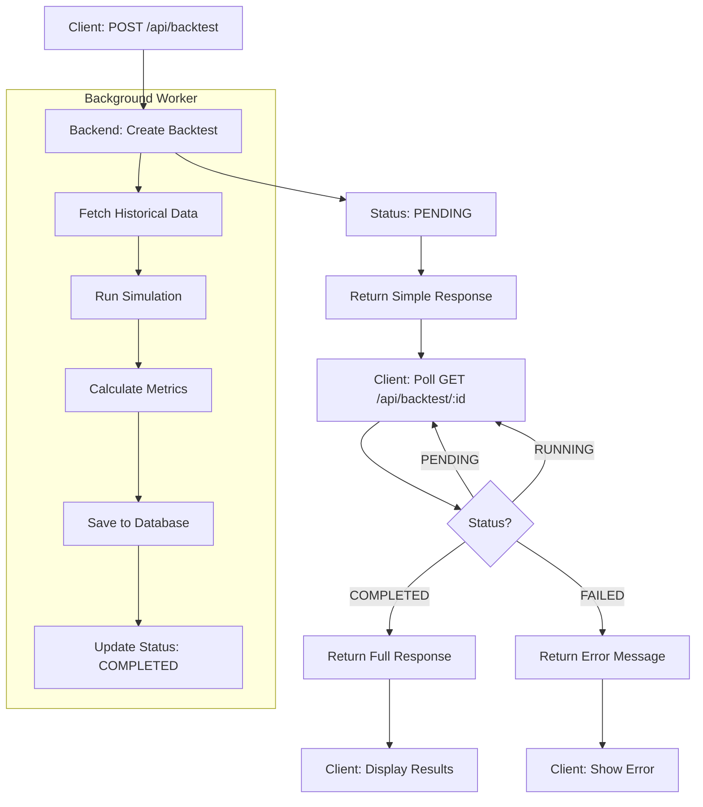

# Backtest API Documentation

## 📋 Table of Contents

1. [Overview](#overview)
2. [Endpoints](#endpoints)
   - [Create Backtest](#post-apibacktest)
   - [Get All Backtests](#get-apibacktest)
   - [Get Backtest by ID](#get-apibacktestid)
   - [Delete Backtest](#delete-apibacktestid)
3. [Response DTOs](#response-dtos)
   - [BacktestResponse](#backtestresponse)
   - [BacktestSummary](#backtestsummary)
   - [EquityPoint](#equitypoint)
   - [CandleData (OHLCV)](#candledata-ohlcv)
   - [BacktestTradeDTO](#backtesttradedto)
   - [TradeEntry](#tradeentry)
   - [TradeExit](#tradeexit)
   - [TradeTargets](#tradetargets)
   - [DailyStatsSnapshot](#dailystatssnapshot)
4. [Examples](#examples)
5. [Flow Diagram](#flow-diagram)

---

## 🌐 Overview

Backtest API memungkinkan Anda untuk menjalankan backtest strategy trading terhadap data historis dan melihat hasilnya secara detail.

**Base URL:** `http://localhost:8000/api`

**Authentication:** Required (Bearer Token)

**Key Features:**
- ✅ Run backtest on historical data
- ✅ Multi-timeframe analysis
- ✅ 5-Gate validation (same as live system)
- ✅ Detailed trade history with entries/exits
- ✅ Equity curve tracking
- ✅ OHLCV data for charting
- ✅ Strategy snapshot preservation

---

## 📡 Endpoints

### **POST /api/backtest**

Create and run a new backtest.

**Request:**
```json
{
  "name": "BTC Backtest January 2024",
  "symbol": "BTCUSDT",
  "strategy_id": 1,
  "days": 30,
  "capital": 1000
}
```

**Request Fields:**

| Field | Type | Required | Description |
|-------|------|----------|-------------|
| `name` | string | ✅ | Name of the backtest |
| `symbol` | string | ✅ | Trading pair (e.g., BTCUSDT) |
| `strategy_id` | uint | ✅ | ID of strategy to test |
| `days` | int | ✅ | Backtest period in days (1-30) |
| `capital` | float64 | ✅ | Initial capital in USDT (min: 10) |

**Response (Simple - Status: PENDING):**
```json
{
  "code": 200,
  "message": "success",
  "data": {
    "id": 1,
    "name": "BTC Backtest January 2024",
    "symbol": "BTCUSDT",
    "strategy_id": 1,
    "start_time": "2024-01-01T00:00:00Z",
    "end_time": "2024-01-31T23:59:59Z",
    "capital": 1000,
    "status": "PENDING",
    "created_at": "2024-03-19T10:30:00Z"
  }
}
```

**Status Flow:**
```
PENDING → RUNNING → COMPLETED / FAILED
```

---

### **GET /api/backtest**

Get list of all backtests (summary view).

**Request:**
```bash
GET http://localhost:8000/api/backtest
```

**Response:**
```json
{
  "code": 200,
  "message": "success",
  "data": [
    {
      "id": 1,
      "name": "BTC Backtest January 2024",
      "symbol": "BTCUSDT",
      "strategy_name": "Day Trading Pro",
      "total_pnl": 150.50,
      "total_pnl_percent": 15.05,
      "win_rate": 65.5,
      "total_trades": 20,
      "status": "COMPLETED",
      "created_at": "2024-03-19T10:30:00Z"
    }
  ]
}
```

---

### **GET /api/backtest/:id**

Get detailed backtest result by ID (with OHLCV, equity curve, and trades).

**Request:**
```bash
GET http://localhost:8000/api/backtest/1
```

**Response (Full Detail):**
```json
{
  "code": 200,
  "message": "success",
  "data": {
    "id": 1,
    "name": "BTC Backtest January 2024",
    "symbol": "BTCUSDT",
    "strategy_id": 1,
    "start_time": "2024-01-01T00:00:00Z",
    "end_time": "2024-01-31T23:59:59Z",
    "capital": 1000,
    "summary": {
      "initial_balance": 1000.00,
      "final_balance": 1150.50,
      "net_profit": 150.50,
      "net_profit_percent": 15.05,
      "win_rate_pct": 65.5,
      "total_trades": 20,
      "winning_trades": 13,
      "losing_trades": 7,
      "expired_trades": 2,
      "cancelled_trades": 1,
      "max_drawdown_pct": 5.2,
      "profit_factor": 1.8,
      "avg_win": 25.50,
      "avg_loss": -12.30,
      "largest_win": 85.00,
      "largest_loss": -35.00
    },
    "equity_curve": [
      {
        "timestamp": 1704067200000,
        "balance": 1000.00,
        "pnl": 0.00
      },
      {
        "timestamp": 1704153600000,
        "balance": 1025.00,
        "pnl": 25.00
      }
    ],
    "ohlcv": [
      {
        "timestamp": 1704067200000,
        "open": 42000.00,
        "high": 42500.00,
        "low": 41800.00,
        "close": 42300.00,
        "volume": 1234.56
      }
    ],
    "trades": [
      {
        "trade_id": 1,
        "trade_num": 1,
        "side": "BUY",
        "signal": "STRONG_BUY",
        "confidence": 75.5,
        "trading_mode": "CONSERVATIVE",
        "status": "CLOSED",
        "targets": {
          "tp_price": 43000.00,
          "sl_price": 41500.00,
          "ratio": 2.5
        },
        "entries": [
          {
            "entry_num": 1,
            "type": "MARKET",
            "price": 42300.00,
            "qty": 0.05,
            "timestamp": 1704067200000,
            "status": "FILLED"
          },
          {
            "entry_num": 2,
            "type": "LIMIT",
            "price": 42000.00,
            "qty": 0.03,
            "timestamp": 1704070800000,
            "status": "FILLED"
          }
        ],
        "exit": {
          "reason": "HIT_TP",
          "price": 43000.00,
          "timestamp": 1704153600000
        },
        "total_qty": 0.08,
        "avg_entry_price": 42187.50,
        "total_capital": 150.00,
        "pnl": 50.00,
        "pnl_percent": 33.33,
        "entry_time": "2024-01-01T00:00:00Z",
        "filled_time": "2024-01-01T00:00:00Z",
        "exit_time": "2024-01-02T00:00:00Z",
        "duration_minutes": 1440,
        "daily_stats": {
          "trade_count": 1,
          "pnl": 0.00,
          "consecutive_loss": 0
        }
      }
    ],
    "status": "COMPLETED",
    "created_at": "2024-03-19T10:30:00Z",
    "completed_at": "2024-03-19T10:35:00Z",
    "strategy": {
      "id": 1,
      "strategy_name": "Day Trading Pro",
      "primary_tf": "15m",
      "is_active": true,
      "money_management": {
        "min_confidence": 50,
        "max_daily_trades": 5,
        "max_daily_loss_percent": 0.05,
        "leverage": 10,
        "is_agressive": false
      }
    }
  }
}
```

---

### **DELETE /api/backtest/:id**

Delete a backtest and its associated trades.

**Request:**
```bash
DELETE http://localhost:8000/api/backtest/1
```

**Response:**
```json
{
  "code": 200,
  "message": "success",
  "data": { ... } // Same as GET response
}
```

---

## 📦 Response DTOs

### **BacktestResponse**

Main response structure for backtest details.

| Field | Type | Description |
|-------|------|-------------|
| `id` | uint | Backtest ID |
| `name` | string | Backtest name |
| `symbol` | string | Trading pair |
| `strategy_id` | uint | Strategy ID used |
| `start_time` | time.Time | Backtest start time |
| `end_time` | time.Time | Backtest end time |
| `capital` | float64 | Initial capital |
| `summary` | BacktestSummary | Performance summary |
| `equity_curve` | []EquityPoint | Balance progression |
| `ohlcv` | []CandleData | OHLCV data for charting |
| `trades` | []BacktestTradeDTO | Trade history |
| `status` | string | PENDING/RUNNING/COMPLETED/FAILED |
| `error_message` | string | Error message if FAILED |
| `created_at` | time.Time | Creation timestamp |
| `completed_at` | *time.Time | Completion timestamp |
| `strategy` | *StrategyData | Strategy snapshot |

---

### **BacktestSummary**

Performance metrics summary.

| Field | Type | Description |
|-------|------|-------------|
| `initial_balance` | float64 | Starting balance |
| `final_balance` | float64 | Ending balance |
| `net_profit` | float64 | Total PnL |
| `net_profit_percent` | float64 | PnL percentage |
| `win_rate_pct` | float64 | Win rate % |
| `total_trades` | int | Total trades |
| `winning_trades` | int | Winning trades count |
| `losing_trades` | int | Losing trades count |
| `expired_trades` | int | Expired orders count |
| `cancelled_trades` | int | Cancelled trades count |
| `max_drawdown_pct` | float64 | Maximum drawdown % |
| `profit_factor` | float64 | Profit/Loss ratio |
| `avg_win` | float64 | Average win |
| `avg_loss` | float64 | Average loss |
| `largest_win` | float64 | Biggest win |
| `largest_loss` | float64 | Biggest loss |

---

### **EquityPoint**

Single point in equity curve.

| Field | Type | Description |
|-------|------|-------------|
| `timestamp` | int64 | Unix timestamp (ms) |
| `balance` | float64 | Balance at this point |
| `pnl` | float64 | PnL from initial balance |

---

### **CandleData (OHLCV)**

OHLCV candle data for charting.

| Field | Type | Description |
|-------|------|-------------|
| `timestamp` | int64 | Unix timestamp (ms) |
| `open` | float64 | Open price |
| `high` | float64 | High price |
| `low` | float64 | Low price |
| `close` | float64 | Close price |
| `volume` | float64 | Volume |

---

### **BacktestTradeDTO**

Individual trade details.

| Field | Type | Description |
|-------|------|-------------|
| `trade_id` | uint | Trade ID |
| `trade_num` | int | Sequential trade number |
| `side` | string | BUY or SELL |
| `signal` | string | Signal type (STRONG_BUY, etc.) |
| `confidence` | float64 | Confidence score |
| `trading_mode` | string | AGGRESSIVE/CONSERVATIVE |
| `status` | string | ACTIVE/CLOSED/CANCELLED/EXPIRED |
| `targets` | TradeTargets | TP/SL targets |
| `entries` | []TradeEntry | Entry orders |
| `exit` | *TradeExit | Exit information |
| `total_qty` | float64 | Total quantity filled |
| `avg_entry_price` | float64 | Average entry price |
| `total_capital` | float64 | Capital used |
| `pnl` | float64 | PnL in USDT |
| `pnl_percent` | float64 | PnL percentage |
| `entry_time` | time.Time | Signal time |
| `filled_time` | *time.Time | First fill time |
| `exit_time` | *time.Time | Exit time |
| `duration_minutes` | int64 | Trade duration |
| `daily_stats` | *DailyStatsSnapshot | Daily stats snapshot |

---

### **TradeEntry**

Single entry in multi-entry trade.

| Field | Type | Description |
|-------|------|-------------|
| `entry_num` | int | Entry number (1, 2, 3...) |
| `type` | string | MARKET or LIMIT |
| `price` | float64 | Entry price |
| `qty` | float64 | Quantity |
| `timestamp` | time.Time | Fill/create time |
| `status` | string | PENDING/FILLED/CANCELLED/EXPIRED |

---

### **TradeExit**

Exit information.

| Field | Type | Description |
|-------|------|-------------|
| `reason` | string | HIT_TP/HIT_SL/CLOSED_END/DEAD_SIGNAL/EXPIRED |
| `price` | float64 | Exit price |
| `timestamp` | time.Time | Exit time |

---

### **TradeTargets**

TP/SL targets from trading plan.

| Field | Type | Description |
|-------|------|-------------|
| `tp_price` | float64 | Take profit price |
| `sl_price` | float64 | Stop loss price |
| `ratio` | float64 | Risk-reward ratio |

---

### **DailyStatsSnapshot**

Daily statistics at trade entry.

| Field | Type | Description |
|-------|------|-------------|
| `trade_count` | int | Trades today |
| `pnl` | float64 | Daily PnL |
| `consecutive_loss` | int | Consecutive losses |

---

## 💡 Examples

### **Example 1: Create and Monitor Backtest**

```javascript
// 1. Create backtest
const createResponse = await fetch('/api/backtest', {
  method: 'POST',
  headers: {
    'Authorization': 'Bearer <token>',
    'Content-Type': 'application/json'
  },
  body: JSON.stringify({
    name: 'BTC Backtest',
    symbol: 'BTCUSDT',
    strategy_id: 1,
    days: 30,
    capital: 1000
  })
})

const { data: { id } } = await createResponse.json()

// 2. Poll for completion
const pollStatus = async () => {
  const response = await fetch(`/api/backtest/${id}`)
  const { data } = await response.json()
  
  if (data.status === 'COMPLETED') {
    console.log('Backtest completed!')
    console.log('Net Profit:', data.summary.net_profit)
    console.log('Win Rate:', data.summary.win_rate_pct)
    
    // Plot equity curve
    const equityChart = {
      x: data.equity_curve.map(p => p.timestamp),
      y: data.equity_curve.map(p => p.balance)
    }
    
    // Plot trades on OHLCV chart
    const candleData = data.ohlcv.map(c => ({
      time: c.timestamp,
      open: c.open,
      high: c.high,
      low: c.low,
      close: c.close
    }))
    
    const tradeMarkers = data.trades.map(t => ({
      time: t.exit_time,
      price: t.avg_entry_price,
      side: t.side,
      pnl: t.pnl
    }))
  } else if (data.status === 'FAILED') {
    console.error('Backtest failed:', data.error_message)
  } else {
    // Still running, poll again in 2 seconds
    setTimeout(pollStatus, 2000)
  }
}

pollStatus()
```

---

### **Example 2: List All Backtests**

```javascript
const response = await fetch('/api/backtest', {
  headers: { 'Authorization': 'Bearer <token>' }
})

const { data } = await response.json()

data.forEach(bt => {
  console.log(`${bt.name}: ${bt.total_pnl} USDT (${bt.win_rate}%)`)
})
```

---

## 🔄 Flow Diagram



---

## 📝 Notes

1. **Backtest runs asynchronously** - Create returns immediately with `PENDING` status
2. **Polling recommended** - Check status every 2-5 seconds until `COMPLETED`
3. **Strategy snapshot** - Strategy config is saved at creation time for reproducibility
4. **OHLCV fetched live** - Price data is fetched from Binance when viewing results
5. **5-Gate validation** - Same risk management rules as live system
6. **Multi-entry support** - Trades can have multiple MARKET/LIMIT entries
7. **Auto-adapt TP/SL** - TP/SL adjusts when additional entries fill

---

## 🔗 Related Documentation

- [TRADE_BACKTEST_FLOW.md](./TRADE_BACKTEST_FLOW.md) - Detailed simulation flow
- [API_DOCUMENTATION.md](./API_DOCUMENTATION.md) - Main API overview
