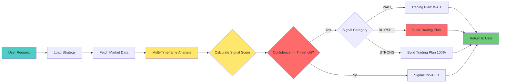

# Signal Analyze Flow Documentation

## 📋 Table of Contents

1. [Business Overview](#business-overview)
2. [What Does Signal Analyze Do?](#what-does-signal-analyze-do)
3. [End-to-End Process Flow](#end-to-end-process-flow)
4. [Input & Output](#input--output)
5. [Decision Logic](#decision-logic)
6. [Risk Management Rules](#risk-management-rules)
7. [Trading Plan Structure](#trading-plan-structure)
8. [Business Examples](#business-examples)
9. [Key Metrics & KPIs](#key-metrics--kpis)

---

## 🌐 Business Overview

### **Purpose**

**Signal Analyze** adalah "otak" dari trading system yang bertugas:
- 📊 Menganalisis kondisi market secara objektif menggunakan multiple indicators
- 🎯 Memberikan rekomendasi trading (BUY/SELL/WAIT) dengan confidence level
- 📋 Menyusun rencana trading lengkap (entry point, target profit, stop loss)
- ⚖️ Menghitung risk-reward ratio untuk setiap opportunity

### **Business Value**

| Benefit | Description |
|---------|-------------|
| **Objective Decision** | Menghilangkan emosi dari trading decision |
| **Consistent Strategy** | Semua trade mengikuti rules yang sama |
| **Risk Control** | Setiap trade punya predefined risk & reward |
| **Multi-Perspective** | Analisis dari multiple timeframes & indicators |
| **Audit Trail** | Semua signal tersimpan untuk performance review |

### **Key Stakeholders**

| Role | Usage |
|------|-------|
| **Trader** | Mendapatkan signal untuk manual execution |
| **Risk Manager** | Memastikan setiap trade memenuhi risk limits |
| **System** | Input untuk automated trade execution |
| **Analyst** | Data untuk backtesting & strategy optimization |

---

## 🤔 What Does Signal Analyze Do?

### **Simple Analogy**

Signal Analyze seperti **financial advisor** yang:

1. **Riset Market** 📚
   - Cek kondisi market dari berbagai sudut (timeframes)
   - Analisis menggunakan 8+ technical indicators

2. **Beri Rekomendasi** 💡
   - "BUY" - Saat market bullish dengan confidence tinggi
   - "SELL" - Saat market bearish dengan confidence tinggi
   - "WAIT" - Saat market tidak jelas, lebih baik tidak trade

3. **Buat Rencana** 📋
   - Entry price: Beli di harga berapa
   - Target: Jual di harga berapa (Take Profit)
   - Protection: Cut loss di harga berapa (Stop Loss)
   - Position size: Pakai modal berapa

4. **Hitung Risk** ⚠️
   - "Jika SL hit, kamu akan rugi $X (Y% dari modal)"
   - "Jika TP hit, kamu akan untung $X (Y% dari modal)"
   - "Risk:Reward ratio = 1:Z"

---

### **Real-World Example**

**Scenario:** Anda punya $1,000 dan ingin trade BTCUSDT

**Tanpa Signal Analyze:**
```
❌ "Hmm, BTC naik terus, kayaknya bakal naik lagi deh..."
❌ "Entry di $50,000 aja, target $52,000, SL di $48,000"
❌ "Modal $1,000 semua aja, biar cepat kaya!"
```

**Dengan Signal Analyze:**
```
✅ Signal: BUY (Confidence: 75%)
✅ Entry: $49,781 (dekat support)
✅ Target: $50,312 (+1.07%)
✅ Stop Loss: $49,125 (-1.32%)
✅ Modal: $400 (50% dari max position, 80% strength)
✅ Risk: Jika SL hit, rugi $26.38 (6.60% dari modal)
✅ Reward: Jika TP hit, untung $21.36 (5.34% dari modal)
✅ R:R = 0.81 (kurang menarik, tapi acceptable)
```

---

## 🔄 End-to-End Process Flow

### **High-Level Flow Diagram**



### **Step-by-Step Process**

#### **Step 1: Load Strategy** (50ms)

**What happens:**
- System mengambil "resep trading" yang sudah disetting
- Setiap strategy punya:
  - Timeframes yang dipantau (1h, 4h, 1d, dll)
  - Indicators yang dipakai (RSI, MACD, dll)
  - Risk limits (max loss, max trades, dll)

**Business Rule:**
```
IF user specify StrategyID → Use that strategy
ELSE → Use currently active strategy
```

---

#### **Step 2: Fetch Market Data** (200-500ms)

**What happens:**
- System download OHLCV data dari Binance
- Data diambil untuk multiple timeframes sekaligus
- Typical: 300 candles per timeframe

**Performance:**
- Parallel fetching: **200-500ms**
- Sequential (old): **600-1500ms**

---

#### **Step 3: Multi-Timeframe Analysis** (100-200ms)

**What happens:**
- Setiap timeframe dianalisis terpisah
- 8+ technical indicators dihitung
- Setiap indicator kasih "vote" (-100 to +100)

**Example:**

**Timeframe 1h (Weight: 60%):**
| Indicator | Vote | Weight | Contribution |
|-----------|------|--------|--------------|
| RSI | +40 (Bullish) | 30% | +12.0 |
| MACD | +56 (Bullish Cross) | 40% | +22.4 |
| Stochastic | +30 (Neutral) | 20% | +6.0 |
| Bollinger | +27 (Upper Half) | 10% | +2.7 |
| **Timeframe Score** | | | **+43.1** |

**Timeframe 4h (Weight: 40%):**
| Indicator | Vote | Weight | Contribution |
|-----------|------|--------|--------------|
| RSI | +60 (Bullish) | 30% | +18.0 |
| MACD | +39 (Above Zero) | 40% | +15.6 |
| Stochastic | +27 (Neutral) | 20% | +5.4 |
| Bollinger | +45 (At Lower Band) | 10% | +4.5 |
| **Timeframe Score** | | | **+43.5** |

---

#### **Step 4: Calculate Final Signal** (<50ms)

**Formula:**
```
Final Signal = (Timeframe1_Score × Weight1) + (Timeframe2_Score × Weight2) + ...

Example:
Final Signal = (43.1 × 0.6) + (43.5 × 0.4)
             = 25.86 + 17.4
             = 43.26 (atau 0.43 dalam decimal)
```

**Categorization:**

| Final Signal | Category | Capital Allocation |
|--------------|----------|-------------------|
| 70% - 100% | STRONG_BUY | 100% |
| 30% - 70% | BUY | 80% |
| -30% - 30% | WAIT | 0% |
| -70% - -30% | SELL | 80% |
| -100% - -70% | STRONG_SELL | 100% |

**Example:**
```
Final Signal: 0.43 (43%)
Category: BUY
Capital Allocation: 80%
```

---

#### **Step 5: Validity Check** (<50ms)

**Business Rule:**
```
IF Confidence >= MIN_CONFIDENCE (65%) → Signal VALID
ELSE → Signal INVALID (skip trade)
```

**Example:**
```
Confidence: 43%
MIN_CONFIDENCE: 65%
Result: ❌ INVALID (43 < 65)

Decision: Skip trade, wait for better setup
```

**Rationale:**
- Mencegah trade dengan signal lemah
- Meningkatkan win rate dengan hanya trade high-quality setups

---

#### **Step 6: Build Trading Plan** (100-200ms)

**What happens:**

1. **Identify Key Levels**
   - Support: Harga dimana buyer masuk
   - Resistance: Harga dimana seller masuk
   - Method: Detect swing high/low dari 100 candles terakhir

2. **Measure Volatility**
   - ATR (Average True Range): Seberapa liar price bergerak
   - High ATR → TP/SL lebih jauh
   - Low ATR → TP/SL lebih dekat

3. **Calculate Levels**
   ```
   For BUY:
     Entry = Support + Buffer
     TP = Resistance - Buffer
     SL = Support - (2× Buffer)
   
   For SELL:
     Entry = Resistance - Buffer
     TP = Support + Buffer
     SL = Resistance + (2× Buffer)
   
   Buffer = ATR × Volatility_Multiplier
   ```

4. **Determine Position Size**
   ```
   Capital Used = Balance × MAX_POSITION_SIZE × Signal_Strength
   
   Example:
   Balance: $1,000
   MAX_POSITION_SIZE: 50%
   Signal: BUY (80% strength)
   
   Capital Used = 1000 × 0.5 × 0.8 = $400
   ```

5. **Calculate Risk Metrics**
   ```
   Risk (USDT) = (Entry - SL) × Quantity
   Risk (%) = Risk_USDT / Capital_Used × 100
   
   Reward (USDT) = (TP - Entry) × Quantity
   Reward (%) = Reward_USDT / Capital_Used × 100
   
   R:R Ratio = Reward / Risk
   ```

---

## 📥 Input & Output

### **Request (Input)**

```json
{
  "symbol": "BTCUSDT",
  "strategy_id": 1,      // Optional: 0 = use active strategy
  "capital": 1000        // Optional: default $50
}
```

**Required Fields:**
- `symbol` (string): Trading pair, contoh: "BTCUSDT", "ETHUSDT"

**Optional Fields:**
- `strategy_id` (number): ID strategy yang mau dipakai
  - `0` atau tidak diisi = pakai strategy yang sedang active
  - `1, 2, 3, ...` = pilih strategy spesifik
- `capital` (number): Modal yang mau dipakai
  - Default: $50
  - Contoh: 1000 = $1,000

---

### **Response (Output)**

```json
{
  "symbol": "BTCUSDT",
  "primary_timeframe": "1h",
  "timestamp": "2025-03-19T14:30:00Z",
  
  "signal": {
    "valid": true,
    "signal": "BUY",
    "current_price": 50000.00,
    
    "trading_plan": {
      "mode": "CONSERVATIVE",
      "entries": [...],
      "take_profit": 50312.50,
      "stop_loss": 49125.00,
      "risk_reward_ratio": 0.81,
      "summary": {...}
    }
  },
  
  "scoring": {
    "total_score": 0.43,
    "confidence": 43.0,
    "breakdown": [...]
  }
}
```

**Key Fields for Business:**

| Field | Meaning | Business Action |
|-------|---------|-----------------|
| `signal.valid` | Apakah signal kuat enough? | `false` = Skip trade |
| `signal.signal` | Rekomendasi aksi | BUY/SELL/WAIT |
| `signal.trading_plan.take_profit` | Target harga jual | Auto-set TP order |
| `signal.trading_plan.stop_loss` | Harga cut loss | Auto-set SL order |
| `signal.trading_plan.risk_reward_ratio` | Risk vs Reward | < 0.5 = Pertimbangkan ulang |
| `scoring.confidence` | Keyakinan system | < 65% = Signal lemah |

---

## 🧠 Decision Logic

### **Signal Generation**

**Scoring System:**

Setiap technical indicator memberikan "vote" dari -100 to +100:

| Vote Range | Sentiment |
|------------|-----------|
| +70 to +100 | Very Bullish |
| +30 to +70 | Bullish |
| -30 to +30 | Neutral |
| -70 to -30 | Bearish |
| -100 to -70 | Very Bearish |

**Weighted Average:**

```
Final Score = Σ(Indicator_Vote × Indicator_Weight)

Example:
RSI: +40 × 30% = +12
MACD: +56 × 40% = +22.4
Stochastic: +30 × 20% = +6
Bollinger: +27 × 10% = +2.7

Final Score = +43.1 (Bullish)
```

---

### **Signal Categories**

| Final Score | Category | Action | Capital |
|-------------|----------|--------|---------|
| +70% to +100% | STRONG_BUY | BUY | 100% |
| +30% to +70% | BUY | BUY | 80% |
| -30% to +30% | WAIT | HOLD | 0% |
| -70% to -30% | SELL | SELL | 80% |
| -100% to -70% | STRONG_SELL | SELL | 100% |

**Capital Allocation Logic:**

```
STRONG signals = System sangat yakin → Pakai modal penuh (100%)
Regular signals = System cukup yakin → Pakai modal sebagian (80%)
WAIT = System tidak yakin → Jangan trade (0%)
```

---

### **Validity Check**

**Business Rule:**

```
Confidence = |Final Score| (absolute value)

IF Confidence >= MIN_CONFIDENCE (65%) → VALID
ELSE → INVALID
```

**Example Scenarios:**

| Final Score | Confidence | MIN_CONFIDENCE | Valid? | Action |
|-------------|------------|----------------|--------|--------|
| +0.80 | 80% | 65% | ✅ Yes | Trade dengan 100% capital |
| +0.50 | 50% | 65% | ❌ No | Skip (signal terlalu lemah) |
| -0.75 | 75% | 65% | ✅ Yes | Trade SELL dengan 100% capital |
| +0.20 | 20% | 65% | ❌ No | Skip (market tidak jelas) |

---

## ⚖️ Risk Management Rules

### **1. Position Sizing**

**Formula:**
```
Capital_Used = Balance × MAX_POSITION_SIZE × Signal_Strength

Signal_Strength:
  STRONG_BUY / STRONG_SELL = 100%
  BUY / SELL = 80%
  WAIT = 0%
```

**Example:**
```
Balance: $10,000
MAX_POSITION_SIZE: 50% (max 50% balance per trade)
Signal: BUY (80% strength)

Capital_Used = 10,000 × 0.5 × 0.8 = $4,000
```

**Business Rationale:**
- MAX_POSITION_SIZE: Mencegah "all-in" pada satu trade
- Signal_Strength: Scaling position berdasarkan confidence

---

### **2. Dynamic TP/SL (ATR-Based)**

**Concept:**
- Market volatile → TP/SL lebih jauh (beri ruang trade bernafas)
- Market calm → TP/SL lebih dekat (cepat take profit/cut loss)

**Formula:**
```
Buffer = ATR × Multiplier

For BUY:
  Entry = Support + (ATR × 1.5)
  TP = Resistance - (ATR × 1.0)
  SL = Support - (ATR × 2.0)

For SELL:
  Entry = Resistance - (ATR × 1.5)
  TP = Support + (ATR × 1.0)
  SL = Resistance + (ATR × 2.0)
```

**Example:**
```
BTCUSDT ATR: $250 (volatility sedang)

BUY Setup:
  Support: $49,500
  Resistance: $50,500
  
  Entry = 49,500 + (250 × 1.5) = $49,875
  TP = 50,500 - (250 × 1.0) = $50,250
  SL = 49,500 - (250 × 2.0) = $49,000
  
  Distance to TP: +$375 (+0.75%)
  Distance to SL: -$875 (-1.76%)
```

**Business Benefit:**
- TP/SL adaptif terhadap market condition
- Prevent premature stop-out saat market volatile
- Lock profit faster saat market calm

---

### **3. Risk-Reward Ratio**

**Formula:**
```
R:R Ratio = Potential_Profit / Potential_Loss
          = (TP - Entry) / (Entry - SL)
```

**Interpretation:**

| R:R Ratio | Quality | Action |
|-----------|---------|--------|
| >= 2.0 | Excellent | ✅ Prioritize trade |
| 1.5 - 2.0 | Good | ✅ Acceptable |
| 1.0 - 1.5 | Fair | ⚠️ Consider carefully |
| < 1.0 | Poor | ❌ Skip (risk > reward) |

**Example:**
```
Entry: $49,875
TP: $50,250
SL: $49,000

Potential_Profit = 50,250 - 49,875 = $375
Potential_Loss = 49,875 - 49,000 = $875

R:R = 375 / 875 = 0.43

Decision: ❌ POOR (risk 2.3x lebih besar dari reward)
```

---

### **4. Leverage Management**

**Leverage Impact:**

```
Tanpa Leverage (1x):
  Capital: $1,000
  Position: $1,000
  Price move 1% → PnL $10 (1%)

Dengan Leverage (5x):
  Capital: $1,000
  Position: $5,000
  Price move 1% → PnL $50 (5%)
```

**Risk Warning:**
```
Leverage amplifies BOTH profit dan loss:
  +1% price move → +5% PnL (5x leverage)
  -1% price move → -5% PnL (5x leverage)
```

**System Default:**
```
LEVERAGE: 5x (moderate)
MAX_POSITION_SIZE: 50% (conservative)

Effective Exposure: 50% × 5x = 2.5x balance
```

---

## 📋 Trading Plan Structure

### **Entry Modes**

#### **CONSERVATIVE Mode** (Single Entry)

**Characteristics:**
- 1 entry point
- LIMIT order (wait for pullback)
- Better fill price
- Risk: Missed opportunity jika price tidak pullback

**Example:**
```json
{
  "mode": "CONSERVATIVE",
  "entries": [
    {
      "entry_number": 1,
      "entry_price": 49875.00,
      "position_size": "100%",
      "position_value": 4000.00,
      "position_qty": 0.402
    }
  ]
}
```

---

#### **AGGRESSIVE Mode** (Multi-Entry)

**Characteristics:**
- 2 entry points
- Entry 1: MARKET order (instant fill)
- Entry 2: LIMIT order (pullback)
- Higher chance of full entry
- Average entry price

**Example:**
```json
{
  "mode": "AGGRESSIVE",
  "entries": [
    {
      "entry_number": 1,
      "entry_price": 50000.00,
      "position_size": "50%",
      "position_value": 2000.00,
      "position_qty": 0.200
    },
    {
      "entry_number": 2,
      "entry_price": 49875.00,
      "position_size": "50%",
      "position_value": 2000.00,
      "position_qty": 0.201
    }
  ]
}
```

---

### **Risk Metrics Summary**

**TradingPlanSummary Fields:**

| Field | Description | Example | Business Meaning |
|-------|-------------|---------|------------------|
| `total_position_value` | Total modal dipakai | $4,000 | Berapa USDT yang dipake |
| `total_position_qty` | Total coin yang dibeli | 0.402 BTC | Berapa BTC yang didapat |
| `avg_entry_price` | Harga rata-rata entry | $49,875 | Harga average beli |
| `max_risk_usdt` | Max kerugian dalam USDT | $350 | Jika SL hit, rugi berapa dollar |
| `risk_from_capital` | Max kerugian dalam % | 8.75% | Jika SL hit, rugi berapa % dari modal ⭐ |
| `target_profit_usdt` | Target profit dalam USDT | $150 | Jika TP hit, untung berapa dollar |
| `profit_from_capital` | Target profit dalam % | 3.75% | Jika TP hit, untung berapa % dari modal ⭐ |
| `effective_leverage` | Leverage yang dipakai | 5.0x | Berapa kali modal di-leverage |

**⚠️ Critical Note:**

Gunakan `risk_from_capital` dan `profit_from_capital` untuk decision, BUKAN `max_risk_percent`!

```
❌ SALAH:
  max_risk_percent = 1.76% → "Wah risk cuma 1.76%, aman!"
  (Ini belum include leverage)

✅ BENAR:
  risk_from_capital = 8.75% → "Risk 8.75% dari modal"
  (Ini sudah include leverage 5x)
```

---

## 💼 Business Examples

### **Example 1: Conservative BUY Setup**

**Scenario:**
- Balance: $10,000
- Strategy: Scalping (MAX_POSITION_SIZE: 50%, LEVERAGE: 5x)
- Signal: BUY (Confidence: 72%)

**Trading Plan:**

```json
{
  "signal": {
    "valid": true,
    "signal": "BUY",
    "current_price": 50000.00,
    "trading_plan": {
      "mode": "CONSERVATIVE",
      "take_profit": 50250.00,
      "stop_loss": 49000.00,
      "risk_reward_ratio": 0.43,
      "summary": {
        "total_position_value": 4000.00,
        "avg_entry_price": 49875.00,
        "max_risk_usdt": 350.00,
        "risk_from_capital": 8.75,
        "target_profit_usdt": 150.00,
        "profit_from_capital": 3.75,
        "effective_leverage": 5.0
      }
    }
  }
}
```

**Business Analysis:**

| Metric | Value | Assessment |
|--------|-------|------------|
| Capital Used | $4,000 | 40% dari balance ($10k) |
| Risk (USDT) | $350 | Jika SL hit, rugi $350 |
| Risk (%) | 8.75% | 8.75% dari modal $4,000 |
| Reward (USDT) | $150 | Jika TP hit, untung $150 |
| Reward (%) | 3.75% | 3.75% dari modal $4,000 |
| R:R Ratio | 0.43 | ❌ POOR (risk 2.3x > reward) |

**Decision:**
```
❌ SKIP TRADE

Reason:
- R:R ratio 0.43 < 1.0 (risk lebih besar dari reward)
- Need to wait for better setup
```

---

### **Example 2: Aggressive STRONG_BUY Setup**

**Scenario:**
- Balance: $10,000
- Strategy: Aggressive Growth (MAX_POSITION_SIZE: 50%, LEVERAGE: 5x)
- Signal: STRONG_BUY (Confidence: 85%)

**Trading Plan:**

```json
{
  "signal": {
    "valid": true,
    "signal": "STRONG_BUY",
    "current_price": 50000.00,
    "trading_plan": {
      "mode": "AGGRESSIVE",
      "take_profit": 51500.00,
      "stop_loss": 48500.00,
      "risk_reward_ratio": 2.0,
      "summary": {
        "total_position_value": 5000.00,
        "avg_entry_price": 50000.00,
        "max_risk_usdt": 150.00,
        "risk_from_capital": 3.0,
        "target_profit_usdt": 300.00,
        "profit_from_capital": 6.0,
        "effective_leverage": 5.0
      }
    }
  }
}
```

**Business Analysis:**

| Metric | Value | Assessment |
|--------|-------|------------|
| Capital Used | $5,000 | 50% dari balance (STRONG signal) |
| Risk (USDT) | $150 | Jika SL hit, rugi $150 |
| Risk (%) | 3.0% | 3% dari modal $5,000 |
| Reward (USDT) | $300 | Jika TP hit, untung $300 |
| Reward (%) | 6.0% | 6% dari modal $5,000 |
| R:R Ratio | 2.0 | ✅ EXCELLENT (reward 2x > risk) |

**Decision:**
```
✅ EXECUTE TRADE

Reason:
- R:R ratio 2.0 >= 2.0 (excellent setup)
- Risk hanya 3% dari modal
- Confidence tinggi (85%)
- STRONG_BUY signal → full capital allocation
```

---

### **Example 3: WAIT Signal**

**Scenario:**
- Balance: $10,000
- Signal: WAIT (Confidence: 25%)

**Trading Plan:**

```json
{
  "signal": {
    "valid": false,
    "signal": "WAIT",
    "current_price": 50000.00,
    "trading_plan": {
      "mode": "WAIT",
      "entries": [],
      "take_profit": 0,
      "stop_loss": 0,
      "risk_reward_ratio": 0,
      "summary": {
        "total_position_value": 0,
        "max_risk_usdt": 0,
        "risk_from_capital": 0,
        "target_profit_usdt": 0,
        "profit_from_capital": 0
      }
    }
  },
  "scoring": {
    "confidence": 25.0
  }
}
```

**Business Analysis:**

| Metric | Value | Assessment |
|--------|-------|------------|
| Confidence | 25% | ❌ LOW (< 65% threshold) |
| Signal | WAIT | Market tidak jelas arah |
| Capital Used | $0 | No trade |

**Decision:**
```
✅ DO NOTHING (Hold)

Reason:
- Confidence 25% < 65% (signal terlalu lemah)
- Market direction tidak jelas
- Better to wait for clearer setup
```

**Business Value:**
- **Tidak trade** juga adalah decision yang bagus
- Mencegah loss dari trade dengan signal lemah
- Wait for better opportunity

---

## 📊 Key Metrics & KPIs

### **Signal Quality Metrics**

| Metric | Formula | Target | Description |
|--------|---------|--------|-------------|
| **Signal Valid Rate** | Valid Signals / Total Signals | > 60% | Berapa % signal yang valid (confidence >= 65%) |
| **STRONG Signal Rate** | STRONG Signals / Total Signals | > 20% | Berapa % signal yang strong (confidence >= 85%) |
| **WAIT Signal Rate** | WAIT Signals / Total Signals | < 30% | Berapa % signal yang WAIT (market unclear) |

---

### **Trading Plan Quality Metrics**

| Metric | Formula | Target | Description |
|--------|---------|--------|-------------|
| **Avg R:R Ratio** | Σ(R:R) / Total Trades | > 1.5 | Average risk-reward ratio dari setup |
| **Excellent Setup Rate** | R:R >= 2.0 / Total Trades | > 25% | Berapa % setup dengan R:R excellent |
| **Poor Setup Rate** | R:R < 1.0 / Total Trades | < 20% | Berapa % setup dengan R:R poor |

---

### **Performance Metrics**

| Metric | Formula | Target | Description |
|--------|---------|--------|-------------|
| **Win Rate** | Winning Trades / Total Trades | > 55% | Berapa % trade yang profit |
| **Avg Win/Loss Ratio** | Avg Win / Avg Loss | > 1.5 | Rata-rata win lebih besar dari loss |
| **Profit Factor** | Gross Profit / Gross Loss | > 1.5 | Total profit vs total loss |
| **Max Drawdown** | Max Peak-to-Trough Decline | < 20% | Max decline dari peak balance |

---

### **Risk Metrics**

| Metric | Formula | Target | Description |
|--------|---------|--------|-------------|
| **Avg Risk per Trade** | Σ(Risk%) / Total Trades | < 5% | Average risk per trade (% dari capital) |
| **Max Daily Loss** | Max Daily PnL Loss | < 5% | Max loss dalam 1 hari |
| **Consecutive Losses** | Max Consecutive Loss Count | < 5 | Max loss berturut-turut |

---

## 📈 Monitoring Dashboard

### **Real-Time Metrics**

```
┌─────────────────────────────────────────────────────────┐
│  SIGNAL ANALYZE DASHBOARD                               │
├─────────────────────────────────────────────────────────┤
│                                                         │
│  Today's Signals:                                       │
│  ├── Total: 15                                          │
│  ├── Valid: 10 (67%) ✅                                 │
│  ├── STRONG: 4 (27%) ✅                                 │
│  └── WAIT: 5 (33%) ⚠️                                   │
│                                                         │
│  Signal Quality:                                        │
│  ├── Avg Confidence: 72% ✅                             │
│  ├── Avg R:R Ratio: 1.8 ✅                              │
│  └── Excellent Setups: 3 (30%) ✅                       │
│                                                         │
│  Performance (Last 30 Days):                            │
│  ├── Win Rate: 62% ✅                                   │
│  ├── Profit Factor: 2.1 ✅                              │
│  ├── Max Drawdown: 12% ✅                               │
│  └── Total PnL: +$1,250 (+12.5%) ✅                     │
│                                                         │
└─────────────────────────────────────────────────────────┘
```

---

## ⚠️ Important Business Notes

### **1. Signal Analyze BUKAN Crystal Ball**

```
❌ SALAH:
  "Signal Analyze selalu benar, tinggal ikut aja!"

✅ BENAR:
  "Signal Analyze adalah decision support tool"
  "Masih perlu risk management dan common sense"
```

**Best Practice:**
- Gunakan signal sebagai **input**, bukan **final decision**
- Tetap apply risk management rules
- Monitor performance dan adjust strategy jika perlu

---

### **2. WAIT Signal Juga Berharga**

```
❌ SALAH:
  "Wah, signal WAIT terus, gak profit-profit!"

✅ BENAR:
  "Signal WAIT mencegah trade di market yang unclear"
  "Tidak trade = Tidak loss = Juga valuable"
```

**Business Value:**
- Mencegah overtrading
- Mengurangi loss dari trade dengan signal lemah
- Wait for high-quality setups

---

### **3. R:R Ratio > Win Rate**

```
❌ SALAH:
  "Yang penting win rate tinggi, R:R gak penting"

✅ BENAR:
  "R:R ratio yang bagus lebih penting dari win rate"
  "Win 50% dengan R:R 2.0 = Profit"
  "Win 70% dengan R:R 0.5 = Loss"
```

**Example:**

**Scenario A (High Win Rate, Poor R:R):**
```
Win Rate: 70%
R:R Ratio: 0.5 (risk $200 to make $100)

10 trades:
  7 wins × $100 = +$700
  3 losses × $200 = -$600
  Net: +$100 (small profit)
```

**Scenario B (Moderate Win Rate, Good R:R):**
```
Win Rate: 50%
R:R Ratio: 2.0 (risk $100 to make $200)

10 trades:
  5 wins × $200 = +$1,000
  5 losses × $100 = -$500
  Net: +$500 (better profit)
```

**Conclusion:**
- Focus pada R:R ratio, bukan hanya win rate
- 1 excellent setup (R:R 2.0+) > 3 poor setups (R:R < 1.0)

---

### **4. Position Sizing is Key**

```
❌ SALAH:
  "Signal kuat, all-in aja!"

✅ BENAR:
  "Sebagus apapun signal, tetap respect position sizing"
  "MAX_POSITION_SIZE ada untuk alasan yang bagus"
```

**Rationale:**
- Tidak ada signal yang 100%准确
- Position sizing melindungi dari black swan events
- Memungkinkan untuk diversifikasi across multiple trades

---

### **5. Leverage is Double-Edged Sword**

```
❌ SALAH:
  "Leverage 100x! Cepat kaya!"

✅ BENAR:
  "Leverage amplifies BOTH profit dan loss"
  "Moderate leverage (5-10x) untuk sustainable trading"
```

**Example:**
```
Leverage 5x:
  +1% price move → +5% PnL
  -1% price move → -5% PnL
  Manageable risk

Leverage 50x:
  +1% price move → +50% PnL
  -1% price move → -50% PnL
  One bad trade = 50% loss (very hard to recover)
```

**Recommendation:**
- Leverage 5-10x untuk crypto futures
- Leverage 1-3x untuk forex
- Avoid leverage > 20x (gambling territory)

---

## 📚 Related Documentation

- [SIGNAL_ANALYZE_RESPONSE.md](./SIGNAL_ANALYZE_RESPONSE.md) - Technical response structure
- [TRADE_EXECUTE_FLOW.md](./TRADE_EXECUTE_FLOW.md) - Trade execution flow
- [TRADE_MONITOR_FLOW.md](./TRADE_MONITOR_FLOW.md) - Trade monitoring & management
- [API_DOCUMENTATION.md](./API_DOCUMENTATION.md) - Complete API reference

---

## 📞 Support

Untuk pertanyaan atau clarification terkait Signal Analyze flow:
- 📧 Email: support@tradingbot.com
- 💬 Slack: #trading-support
- 📖 Documentation: https://docs.tradingbot.com

---

**Document Version:** 1.0  
**Last Updated:** 2025-03-19  
**Author:** Trading Bot Development Team
