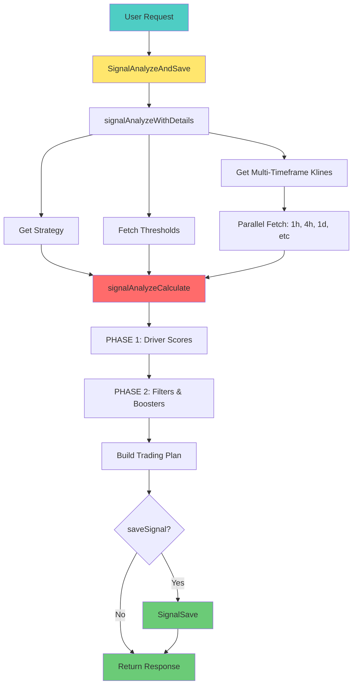

# Signal Analyze Flow Documentation (Updated 2026)

## 📋 Table of Contents

1. [Business Overview](#business-overview)
2. [What Does Signal Analyze Do?](#what-does-signal-analyze-do)
3. [Architecture & Flow](#architecture--flow)
4. [End-to-End Process Flow](#end-to-end-process-flow)
5. [Input & Output](#input--output)
6. [Signal Calculation Logic](#signal-calculation-logic)
7. [Indicator Configuration](#indicator-configuration)
8. [Trading Plan Builder](#trading-plan-builder)
9. [Risk Management Rules](#risk-management-rules)
10. [Code Flow Details](#code-flow-details)
11. [Business Examples](#business-examples)

---

## 🌐 Business Overview

### **Purpose**

**Signal Analyze** adalah "otak" dari trading system yang bertugas:
- 📊 Menganalisis kondisi market secara objektif menggunakan multiple indicators
- 🎯 Memberikan rekomendasi trading (BUY/SELL/WAIT) dengan confidence level
- 📋 Menyusun rencana trading lengkap (entry point, target profit, stop loss)
- ⚖️ Menghitung risk-reward ratio untuk setiap opportunity

### **Key Features**

| Feature | Description |
|---------|-------------|
| **Multi-Timeframe Analysis** | Analisis dari multiple timeframes dengan weighted scoring |
| **Driver-Filter-Booster System** | Advanced signal scoring dengan role-based indicators |
| **Dynamic TP/SL** | ATR-based take profit dan stop loss calculation |
| **Multi-Entry Support** | CONSERVATIVE (single) vs AGGRESSIVE (multi-entry) modes |
| **Snapshot Storage** | Complete signal snapshot untuk audit & backtesting |

---

## 🤔 What Does Signal Analyze Do?

### **Core Functions**

1. **`SignalAnalyzeAndSave()`** - Main entry point
   - Orchestrates entire analysis flow
   - Saves signal to database (optional)
   - Returns: analyzeRes, savedSignal, error

2. **`signalAnalyzeWithDetails()`** - Data fetcher
   - Fetches strategy, thresholds, klines
   - Returns: analyzeRes, strategy, primaryKlines

3. **`signalAnalyzeCalculate()`** - Core analysis engine
   - PHASE 1: Driver score calculation
   - PHASE 2: Filter & Booster application
   - Build trading plan

4. **`SignalSave()`** - Signal persistence
   - Saves signal with all snapshots
   - Uses pre-fetched data (NO duplicate fetch!)

---

## 🔄 Architecture & Flow

### **High-Level Architecture**

```
┌──────────────────────────────────────────────────────────────┐
│  API Layer (Controller)                                      │
│  - SignalAnalyzeHandler                                      │
│  - SignalAnalyzeAndSaveHandler                               │
└────────────────────┬─────────────────────────────────────────┘
                     │
                     ▼
┌──────────────────────────────────────────────────────────────┐
│  Service Layer (signal_analyze_service.go)                   │
│  ┌────────────────────────────────────────────────────────┐  │
│  │ SignalAnalyzeAndSave()                                 │  │
│  │  ↓                                                      │  │
│  │ signalAnalyzeWithDetails()                              │  │
│  │  ├─ StrategyGetActive() / StrategyGetByID()             │  │
│  │  ├─ repo.Threshold.FindAll()                            │  │
│  │  └─ BinanceClient.GetMultiKlines() (parallel)           │  │
│  │  ↓                                                      │  │
│  │ signalAnalyzeCalculate()                                │  │
│  │  ├─ PHASE 1: Driver Scores                              │  │
│  │  ├─ PHASE 2: Filters & Boosters                         │  │
│  │  └─ buildTradingPlan()                                  │  │
│  │  ↓                                                      │  │
│  │ SignalSave() (if saveSignal=true)                       │  │
│  └────────────────────────────────────────────────────────┘  │
└────────────────────┬─────────────────────────────────────────┘
                     │
                     ▼
┌──────────────────────────────────────────────────────────────┐
│  External Dependencies                                       │
│  ┌──────────────┐  ┌──────────────┐  ┌──────────────┐       │
│  │ Binance API  │  │ Indicators   │  │ Helpers      │       │
│  │ (Redis cache)│  │ (8+ types)   │  │ (math, date) │       │
│  └──────────────┘  └──────────────┘  └──────────────┘       │
└──────────────────────────────────────────────────────────────┘
```

### **Data Flow Diagram**



---

## 🔄 End-to-End Process Flow

### **Step-by-Step Process**

#### **Step 1: SignalAnalyzeAndSave Entry** (<10ms)

**File:** `signal_analyze_service.go` (lines 16-50)

```go
func (s *Services) SignalAnalyzeAndSave(
    ctx *gin.Context, 
    req *dtos.SignalAnalyzeRequest, 
    saveSignal bool, 
    strategyID ...uint,
) (*dtos.SignalAnalyzeResponse, *models.Signal, error)
```

**What happens:**
1. Validate request parameters
2. Call `signalAnalyzeWithDetails()` untuk analysis
3. If `saveSignal=true`, call `SignalSave()` dengan pre-fetched data
4. Return response

**Key Point:**
```go
// NO duplicate fetch! Data di-pass dari analysis
savedSignal, err = s.SignalSave(ctx, analyzeRes, req.Capital, strategy, primaryKlines)
```

---

#### **Step 2: signalAnalyzeWithDetails** (50-150ms)

**File:** `signal_analyze_service.go` (lines 120-178)

```go
func (s *Services) signalAnalyzeWithDetails(
    ctx *gin.Context, 
    req *dtos.SignalAnalyzeRequest,
) (*dtos.SignalAnalyzeResponse, *dtos.StrategyData, []binance.KlineInfo, error)
```

**What happens:**

1. **Validate symbol** (<1ms)
   ```go
   if req.Symbol == "" {
       return nil, nil, nil, fmt.Errorf("symbol is required")
   }
   ```

2. **Get strategy** (10-30ms)
   ```go
   if req.StrategyID > 0 {
       strategy, err = s.StrategyGetByID(ctx, req.StrategyID)
   } else {
       strategy, err = s.StrategyGetActive(ctx)
   }
   ```

3. **Fetch thresholds** (5-10ms)
   ```go
   thresholds, err := s.repo.Threshold.FindAll(nil)
   ```

4. **Build timeframe requests** (<1ms)
   ```go
   timeframeKlines := make([]binance.MultiKlineRequest, 0, len(strategy.Timeframes))
   for _, tf := range strategy.Timeframes {
       timeframeKlines = append(timeframeKlines, binance.MultiKlineRequest{
           Interval: tf.TimeframeName,
           Limit:    300,
       })
   }
   ```

5. **Fetch klines (PARALLEL)** (100-300ms)
   ```go
   binanceData, err := s.BinanceClient.GetMultiKlines(req.Symbol, timeframeKlines)
   ```

6. **Call signalAnalyzeCalculate** (<1ms)
   ```go
   analyzeRes, err := s.signalAnalyzeCalculate(req.Symbol, tradCapital, strategy, binanceData, thresholds)
   ```

**Returns:**
- `analyzeRes` - Complete analysis result
- `strategy` - Strategy data (untuk snapshot)
- `primaryKlines` - Primary TF klines (untuk OHLC snapshot)

---

#### **Step 3: signalAnalyzeCalculate - PHASE 1** (50-100ms)

**File:** `signal_analyze_service.go` (lines 180-260)

**Purpose:** Calculate DRIVER scores untuk semua timeframes

```go
// PHASE 1: Pre-compute DRIVER scores for all TFs
type driverPrecompute struct {
    Score     float64
    HasDriver bool
    OhlcData  []indicators.OHLCData
    Closes    []float64
    CacheKey  string
    Breakdown []dtos.IndicatorBreakdown
}
```

**Flow:**

1. **For each timeframe:**
   ```go
   for _, tf := range strategy.Timeframes {
       // Get klines from binanceData map
       klines := binanceData[tf.TimeframeName]
       
       // Convert to OHLCData
       ohlcData, closes := convertKlinesToOHLCV(klines)
       
       // Cache key untuk indicator caching
       cacheKey := fmt.Sprintf("%s_%d", tf.TimeframeName, time.Now().UnixMilli())
   }
   ```

2. **For each DRIVER indicator:**
   ```go
   for _, iw := range strategy.IndicatorWeights {
       if iw.IndicatorDetail.Role == "DRIVER" {
           result, err := indicators.AnalyzeIndicatorWithConfig(
               iw.IndicatorDetail.Indicator, 
               ohlcData, 
               closes, 
               cacheKey, 
               &s.cfg.INDICATORS,
           )
           
           contribution := float64(result.Signal) * iw.Weight
           dp.Score += contribution
       }
   }
   ```

3. **Calculate global inherited driver score:**
   ```go
   var globalDriverScore float64
   var globalDriverWeightSum float64
   
   for _, tf := range strategy.Timeframes {
       dp := driverMap[tf.TimeframeName]
       if dp.HasDriver {
           globalDriverScore += dp.Score * tf.Weight
           globalDriverWeightSum += tf.Weight
       }
   }
   
   if globalDriverWeightSum > 0 {
       globalDriverScore /= globalDriverWeightSum
   }
   ```

**Example:**
```
Timeframe 1h (Weight: 0.6):
  RSI (DRIVER): +40 × 0.3 = +12
  MACD (DRIVER): +56 × 0.4 = +22.4
  Local Score: +43.1

Timeframe 4h (Weight: 0.4):
  RSI (DRIVER): +60 × 0.3 = +18
  MACD (DRIVER): +39 × 0.4 = +15.6
  Local Score: +43.5

Global Driver Score:
  (43.1 × 0.6) + (43.5 × 0.4) = 43.26
```

---

#### **Step 4: signalAnalyzeCalculate - PHASE 2** (50-100ms)

**File:** `signal_analyze_service.go` (lines 261-330)

**Purpose:** Apply FILTER & BOOSTER indicators

```go
// PHASE 2: Apply FILTER & BOOSTER per TF
for _, tf := range strategy.Timeframes {
    dp := driverMap[tf.TimeframeName]
    
    // Use local driver if available, else inherit global
    driverScore := dp.Score
    if !dp.HasDriver {
        driverScore = globalDriverScore
    }
    
    driverOrientation := 1.0
    if driverScore < 0 {
        driverOrientation = -1.0
    }
    
    filterMultiplier := 1.0
    boosterMultiplier := 1.0
```

**FILTER Logic:**
```go
if role == "FILTER" && driverOrientation != 0 {
    agreement := (rawSignal / 100.0) * driverOrientation
    if agreement < 0 { // Disagreement
        penaltyScale := math.Abs(agreement)
        mult := 1.0 - (penaltyScale * (1.0 - iw.Weight))
        filterMultiplier *= mult
    }
}
```

**BOOSTER Logic:**
```go
if role == "BOOSTER" && driverOrientation != 0 {
    agreement := (rawSignal / 100.0) * driverOrientation
    if agreement > 0 { // Agreement
        boostScale := agreement
        mult := 1.0 + (boostScale * (iw.Weight - 1.0))
        boosterMultiplier *= mult
    }
}
```

**Final TF Score:**
```go
tfSignal := driverScore * filterMultiplier * boosterMultiplier
tfContribution := tfSignal * tf.Weight
finalSignal += tfContribution
```

**Example:**
```
Timeframe 1h:
  Driver Score: +43.1
  Filter Multiplier: 0.85 (RSI FILTER disagree)
  Booster Multiplier: 1.15 (Volume BOOSTER agree)
  
  TF Signal: 43.1 × 0.85 × 1.15 = 42.1
  Contribution: 42.1 × 0.6 = 25.26
```

---

#### **Step 5: Signal Categorization** (<10ms)

**File:** `signal_analyze_service.go` (lines 331-345)

```go
signal, _ := getCategoryFromThreshold(finalSignal, thresholds)
confidence := math.Abs(finalSignal)

// Check signal validity
minConfidence := float64(config.MIN_CONFIDENCE)
signalValid := confidence >= minConfidence
```

**Threshold Categories:**
```go
[]ThresholdConfig{
    {CATEGORY: "STRONG_BUY", MAX: 100, MIN: 70, ACTION: "BUY"},
    {CATEGORY: "BUY", MAX: 70, MIN: 45, ACTION: "BUY"},
    {CATEGORY: "WAIT", MAX: 45, MIN: -45, ACTION: "WAIT"},
    {CATEGORY: "SELL", MAX: -45, MIN: -70, ACTION: "SELL"},
    {CATEGORY: "STRONG_SELL", MAX: -70, MIN: -100, ACTION: "SELL"},
}
```

**Example:**
```
Final Signal: 43.26
Confidence: 43.26%
MIN_CONFIDENCE: 65%

Result:
  Category: WAIT (43.26 dalam range -45 to 45)
  Valid: false (43.26 < 65)
```

---

#### **Step 6: Build Trading Plan** (50-100ms)

**File:** `signal_analyze_service.go` (lines 363-570)

```go
func (s *Services) buildTradingPlan(
    currentPrice float64,
    tradingCapital float64,
    signal string,
    primaryKlines []binance.KlineInfo,
    config *dtos.MMConfigResponse,
) *dtos.TradingPlan
```

**Flow:**

1. **Get current price:**
   ```go
   currentPrice := primaryKlines[len(primaryKlines)-1].Close
   ```

2. **Calculate ATR:**
   ```go
   atrResult := indicators.AnalyzeATRWithConfig(ohlcData, closes, s.cfg)
   atrValue := atrResult.ATR
   ```

3. **Calculate Support/Resistance:**
   ```go
   srResult := indicators.AnalyzeSRWithParams(ohlcData, closes, s.cfg.INDICATORS.SUPPORT_RESIST)
   support := srResult.NearestSup
   resistance := srResult.NearestRes
   ```

4. **Calculate dynamic buffer:**
   ```go
   atrMultiplier := bufferPercent * 100.0 // e.g., 0.75% → 0.75x ATR
   entryBuf := atrValue * (atrMultiplier * 1.5)
   tpBuf := atrValue * atrMultiplier
   slBuf := atrValue * (atrMultiplier * 2.0)
   ```

5. **Build entries (CONSERVATIVE vs AGGRESSIVE):**
   ```go
   if isAggressive {
       // 2 entries: 50% MARKET + 50% LIMIT
   } else {
       // 1 entry: LIMIT order
   }
   ```

6. **Calculate summary:**
   ```go
   totalValue := sum(entry.PositionValue)
   totalQty := sum(entry.PositionQty)
   avgEntryPrice := (totalValue * leverage) / totalQty
   
   maxRiskUSDT := (avgEntryPrice - sl) * totalQty  // BUY
   targetProfitUSDT := (tp - avgEntryPrice) * totalQty
   
   riskFromCapital := (maxRiskUSDT / tradingCapital) * 100
   profitFromCapital := (targetProfitUSDT / tradingCapital) * 100
   ```

---

#### **Step 7: SignalSave** (50-100ms)

**File:** `signal_service.go` (lines 19-188)

```go
func (s *Services) SignalSave(
    ctx *gin.Context,
    analyzeRes *dtos.SignalAnalyzeResponse,
    tradCapital float64,
    strategy *dtos.StrategyData,
    primaryKlines []binance.KlineInfo,
) (*models.Signal, error)
```

**What happens:**

1. **Build strategySnapshot:**
   ```go
   strategySnapshot := map[string]interface{}{
       "id": strategy.ID,
       "name": strategy.StrategyName,
       "timeframes": timeframes,
       "primary_timeframe": strategy.PrimaryTF,
       "indicator_weights": indicatorWeights,
       "mm_config": mmConfig,
   }
   ```

2. **Build ohlcSnapshot:**
   ```go
   candles := make([]map[string]interface{}, len(primaryKlines))
   for _, k := range primaryKlines {
       candles = append(candles, map[string]interface{}{
           "time": k.OpenTime / 1000,
           "open": k.Open,
           "high": k.High,
           "low": k.Low,
           "close": k.Close,
           "volume": k.Volume,
       })
   }
   ```

3. **Build indicatorValues & entryLevels**

4. **Save to database:**
   ```go
   result, err := s.repo.TxManager.WithinTransactionWithResult(func(tx *gorm.DB) (interface{}, error) {
       savedSignal, err := s.repo.Signal.Create(tx, signal)
       return savedSignal, nil
   })
   ```

**⚠️ CRITICAL:** Fungsi ini **TIDAK** fetch data lagi dari DB/Binance!

---

## 📥 Input & Output

### **Request (Input)**

```json
{
  "symbol": "BTCUSDT",
  "strategy_id": 1,      // Optional: 0 = use active strategy
  "capital": 1000        // Optional: default $50
}
```

**Fields:**
- `symbol` (string, required): Trading pair
- `strategy_id` (uint, optional): Strategy ID (0 = active)
- `capital` (float64, optional): Trading capital (default: $50)

---

### **Response (Output)**

```json
{
  "symbol": "BTCUSDT",
  "primary_timeframe": "1h",
  "timestamp": "2026-03-27T10:30:00Z",
  
  "signal": {
    "valid": true,
    "signal": "BUY",
    "current_price": 50000.00,
    
    "trading_plan": {
      "mode": "CONSERVATIVE",
      "entries": [
        {
          "entry_number": 1,
          "entry_price": 49875.00,
          "position_size": "100%",
          "position_value": 4000.00,
          "position_qty": 0.402
        }
      ],
      "take_profit": 50250.00,
      "stop_loss": 49000.00,
      "resistance": 50500.00,
      "support": 49500.00,
      "risk_reward_ratio": 0.43,
      "buffer_percent": 0.75,
      
      "summary": {
        "capital_used": 4000.00,
        "total_entries": 1,
        "total_position_value": 4000.00,
        "total_position_qty": 0.402,
        "avg_entry_price": 49875.00,
        "max_risk_usdt": 350.00,
        "max_risk_percent": 1.76,
        "risk_from_capital": 8.75,
        "target_profit_usdt": 150.00,
        "target_profit_percent": 3.75,
        "profit_from_capital": 3.75,
        "effective_leverage": 5.0
      }
    }
  },
  
  "scoring": {
    "total_score": 43.26,
    "confidence": 43.26,
    "breakdown": [
      {
        "timeframe": "1h",
        "trend": "BUY",
        "raw_signal": 42.1,
        "weight": 0.6,
        "contribution": 25.26,
        "indicator": [
          {
            "name": "RSI",
            "role": "DRIVER",
            "raw_signal": 40,
            "weight": 0.3,
            "contribution": 12.0,
            "details": ["RSI 58.5 Bullish"],
            "value": 58.5,
            "zone": "BULLISH"
          }
        ]
      }
    ]
  }
}
```

---

## 🧠 Signal Calculation Logic

### **Scoring Formula**

```
Final Signal = Σ(TF_Signal × TF_Weight)

Where:
  TF_Signal = Driver_Score × Filter_Multiplier × Booster_Multiplier
  
  Driver_Score = Σ(Indicator_Signal × Indicator_Weight)
  
  Filter_Multiplier = Π(1.0 - penaltyScale × (1.0 - weight))
  
  Booster_Multiplier = Π(1.0 + boostScale × (weight - 1.0))
```

### **Signal Categories**

| Final Signal | Category | Capital Allocation |
|--------------|----------|-------------------|
| 70 - 100 | STRONG_BUY | 100% |
| 45 - 70 | BUY | 80% |
| -45 - 45 | WAIT | 0% |
| -70 - -45 | SELL | 80% |
| -100 - -70 | STRONG_SELL | 100% |

### **Validity Check**

```go
signalValid := confidence >= MIN_CONFIDENCE

// Default: MIN_CONFIDENCE = 65
if confidence >= 65 → VALID
else → INVALID
```

---

## ⚙️ Indicator Configuration

### **Default Config Values**

**File:** `config/config.go` (lines 167-208)

```go
// LoadConfig() default values
config.INDICATORS.MACD = IndicatorMACD{
    FAST:   12,
    SLOW:   26,
    SIGNAL: 9,
}

config.INDICATORS.RSI = IndicatorRSI{
    PERIOD:     14,
    OVERBOUGHT: 70,
    OVERSOLD:   30,
}

config.INDICATORS.STOCHASTIC = IndicatorStochastic{
    K_PERIOD:   14,
    D_PERIOD:   3,
    SMOOTH:     3,
    OVERBOUGHT: 80,
    OVERSOLD:   20,
}

config.INDICATORS.BOLLINGER = IndicatorBollinger{
    PERIOD:  20,
    STD_DEV: 2.0,
}

config.INDICATORS.ATR = IndicatorATR{
    PERIOD: 14,
}

config.INDICATORS.VOLUME = IndicatorVolume{
    MA_PERIOD: 20,
}

config.INDICATORS.MOVING_AVERAGE = IndicatorMovingAverage{
    SMA_PERIODS: []int{20, 50, 200},
    EMA_PERIODS: []int{12, 26},
}

config.INDICATORS.SUPPORT_RESIST = SRConfig{
    LOOKBACK_PERIODS: 200,
    TOLERANCE:        0.006,  // 0.6%
    MIN_TOUCHES:      2,
}
```

### **Money Management Config**

**File:** `config/config.go` (lines 147-164)

```go
config.MM.MIN_CONFIDENCE = 65
config.MM.MAX_DAILY_TRADES = 10
config.MM.MAX_DAILY_LOSS_PERCENT = 0.05  // 5%
config.MM.MAX_DAILY_LOSS_COUNT = 5
config.MM.RISK_REWARD_RATIO = 2.0
config.MM.RISK_REWARD_TARGET = 3.0
config.MM.RISK_ENTRY_BUFFER = 0.0075  // 0.75%
config.MM.MAX_POSITION_SIZE = 0.15    // 15%
config.MM.LEVERAGE = 5
config.MM.IS_AGRESSIVE = false
config.MM.ORDER_EXPIRATION_HOURS = 4
```

### **Threshold Config**

**File:** `config/config.go` (lines 166-173)

```go
config.Threshold = []ThresholdConfig{
    {CATEGORY: "STRONG_BUY", MAX: 100, MIN: 70, ACTION: "BUY"},
    {CATEGORY: "BUY", MAX: 70, MIN: 45, ACTION: "BUY"},
    {CATEGORY: "WAIT", MAX: 45, MIN: -45, ACTION: "WAIT"},
    {CATEGORY: "SELL", MAX: -45, MIN: -70, ACTION: "SELL"},
    {CATEGORY: "STRONG_SELL", MAX: -70, MIN: -100, ACTION: "SELL"},
}
```

---

### **Indicator Details**

#### **1. RSI (Relative Strength Index)**

**File:** `helpers/indicators/rsi.go`

**Config:**
```go
RSIParameters{
    Period:     14,
    Overbought: 70,
    Oversold:   30,
}
```

**Scoring Logic:**
```go
if current >= 70 {
    zone = "OVERBOUGHT"
    signal -= 60  // Bearish
} else if current <= 30 {
    zone = "OVERSOLD"
    signal += 60  // Bullish
} else if current > 50 {
    zone = "BULLISH"
    signal += 40
} else {
    zone = "BEARISH"
    signal -= 40
}

// 50-line cross
if prev < 50 && current >= 50 {
    signal += 40  // Bullish cross
} else if prev > 50 && current <= 50 {
    signal -= 40  // Bearish cross
}
```

**Signal Range:** -100 to +100

---

#### **2. MACD (Moving Average Convergence Divergence)**

**File:** `helpers/indicators/macd.go`

**Config:**
```go
MACDParameters{
    Fast:   12,
    Slow:   26,
    Signal: 9,
}
```

**Scoring Logic:**
```go
// MACD/Signal cross
if prevMACD <= prevSig && currMACD > currSig {
    signal += 44  // Bullish cross
} else if prevMACD >= prevSig && currMACD < currSig {
    signal -= 44  // Bearish cross
} else if currMACD > currSig {
    signal += 22  // Above signal
} else {
    signal -= 22  // Below signal
}

// MACD above/below zero
if currMACD > 0 {
    signal += 17
} else {
    signal -= 17
}

// Histogram rising/falling
if currHist > prevHist {
    signal += 17
} else {
    signal -= 17
}
```

**Max Signal:** ±(44+22+17+17) = ±100

---

#### **3. Stochastic Oscillator**

**File:** `helpers/indicators/stochastic.go`

**Config:**
```go
StochasticParameters{
    K_PERIOD:   14,
    D_PERIOD:   3,
    Smooth:     3,
    Overbought: 80,
    Oversold:   20,
}
```

**Scoring Logic:**
```go
// Use trend-aware analysis
result := AnalyzeStochasticWithTrendAndParams(
    ohlcData, 
    maResult.Signal,    // Trend neutralization
    macdResult.Signal,  // Trend neutralization
    stochasticParam,
)
```

**Features:**
- Trend regime detection (using MA & MACD)
- Neutralizes stochastic in strong trends

---

#### **4. Bollinger Bands**

**File:** `helpers/indicators/bollinger_bands.go`

**Config:**
```go
BBParameters{
    Period:     20,
    StdDevMult: 2.0,
}
```

**Scoring Logic:**
```go
// Position relative to bands
if price <= lowerBand {
    signal += 60  // Oversold
    position = "AT_LOWER_BAND"
} else if price >= upperBand {
    signal -= 60  // Overbought
    position = "AT_UPPER_BAND"
} else if price > middleBand {
    signal += 30  // Upper half (bullish)
    position = "UPPER_HALF"
} else {
    signal -= 30  // Lower half (bearish)
    position = "LOWER_HALF"
}
```

---

#### **5. ATR (Average True Range)**

**File:** `helpers/indicators/atr.go`

**Config:**
```go
ATRParameters{
    Period: 14,
}
```

**Scoring Logic:**
```go
// ATR ratio (current vs average)
ratio := currentATR / avgATR

if ratio >= 1.5 {
    volatility = "HIGH"
    signal -= 50  // High volatility = fear
} else if ratio <= 0.7 {
    volatility = "LOW"
    signal += 50  // Low volatility = calm
}

// ATR trend
if currentATR > prev5ATR {
    signal -= 50  // Rising ATR
} else {
    signal += 50  // Falling ATR
}
```

**Usage in Trading Plan:**
```go
// Dynamic TP/SL buffer
atrMultiplier := bufferPercent * 100.0
entryBuf := atrValue * (atrMultiplier * 1.5)
tpBuf := atrValue * atrMultiplier
slBuf := atrValue * (atrMultiplier * 2.0)
```

---

#### **6. Volume Analysis**

**File:** `helpers/indicators/volume.go`

**Config:**
```go
VolumeParameters{
    MAPeriod: 20,
}
```

**Scoring Logic:**
```go
// Volume ratio
volumeRatio := currentVolume / avgVolume

if volumeRatio >= 2.0 {
    signal += 50  // High volume confirmation
} else if volumeRatio >= 1.5 {
    signal += 25  // Above average
} else if volumeRatio <= 0.5 {
    signal -= 25  // Low volume (weakness)
}
```

---

#### **7. Moving Averages**

**File:** `helpers/indicators/moving_average.go`

**Config:**
```go
MAParameters{
    SMAPeriods: []int{20, 50, 200},
    EMAPeriods: []int{12, 26},
}
```

**Scoring Logic:**
```go
// EMA12 vs EMA26
if EMA12 > EMA26 {
    signal += 25
} else {
    signal -= 25
}

// SMA trend alignment
if SMA20 > SMA50 && SMA50 > SMA200 {
    signal += 35  // Bullish alignment
} else if SMA20 < SMA50 && SMA50 < SMA200 {
    signal -= 35  // Bearish alignment
}

// Price vs SMA200
if price > SMA200 {
    signal += 20
} else {
    signal -= 20
}

// Price vs SMA20
if price > SMA20 {
    signal += 20
} else {
    signal -= 20
}
```

**Max Signal:** ±(25+35+20+20) = ±100

---

#### **8. Support & Resistance (LuxAlgo Style)**

**File:** `helpers/indicators/support_resistance.go`

**Config:**
```go
SRConfig{
    LOOKBACK_PERIODS: 200,
    TOLERANCE:        0.006,  // 0.6%
    MIN_TOUCHES:      2,
}
```

**Algorithm:**
```go
// STEP 1: Find swing highs/lows
swingHighs := findSwingHighs(data, 5)
swingLows := findSwingLows(data, 5)

// STEP 2: Cluster similar levels
resistanceClusters := clusterLevels(swingHighs, tolerance)
supportClusters := clusterLevels(swingLows, tolerance)

// STEP 3: Filter by min touches
validLevels := filterByMinTouches(clusters, minTouches)

// STEP 4: Find nearest S/R
nearestSup := findNearestSupport(validLevels, currentPrice)
nearestRes := findNearestResistance(validLevels, currentPrice)
```

**Usage:** TP/SL calculation

---

### **Caching Strategy**

#### **In-Memory Cache (Indicators)**

**File:** `helpers/indicators/macd.go`, `moving_average.go`

```go
// Thread-safe cache
var (
    macdResultsCache = make(map[string]MACDResult)
    macdCacheMutex   = sync.RWMutex{}
)

// Check cache first
func AnalyzeMACDWithCache(closes []float64, cacheKey string, cfg MACDParameters) MACDResult {
    if result, ok := GetMACDCache(cacheKey); ok {
        return result
    }
    
    result := AnalyzeMACDWithParams(closes, cfg)
    SetMACDCache(cacheKey, result)
    return result
}
```

#### **Redis Cache (Binance Data)**

**File:** `clients/binance/service.go`

```go
// Klines cache (30 seconds)
func (c *Client) GetKlines(symbol string, interval string, limit int) ([]KlineInfo, error) {
    cacheKey := fmt.Sprintf("binance:futures:klines:%s:%s:%d", symbol, interval, limit)
    
    // Try cache first
    var cachedKlines []KlineInfo
    err := c.cache.GetJSON(ctx, cacheKey, &cachedKlines)
    if err == nil && len(cachedKlines) > 0 {
        return cachedKlines, nil
    }
    
    // Fetch from API
    klines := fetchFromAPI()
    
    // Cache for 30 seconds
    _ = c.cache.SetJSON(ctx, cacheKey, klines, 30*time.Second)
    return klines, nil
}
```

**Cache TTL:**
- Price: 5 seconds
- Klines: 30 seconds
- Position: 10 seconds
- Leverage: 72 hours

---

## 📋 Trading Plan Builder

### **Entry Modes**

#### **CONSERVATIVE (Single Entry)**

```json
{
  "mode": "CONSERVATIVE",
  "entries": [
    {
      "entry_number": 1,
      "entry_price": 49875.00,
      "position_size": "100%",
      "position_value": 4000.00,
      "position_qty": 0.402
    }
  ]
}
```

**Characteristics:**
- 1 LIMIT order near support/resistance
- Better fill price
- Risk: May miss opportunity if no pullback

---

#### **AGGRESSIVE (Multi-Entry)**

```json
{
  "mode": "AGGRESSIVE",
  "entries": [
    {
      "entry_number": 1,
      "entry_price": 50000.00,
      "position_size": "50%",
      "position_value": 2000.00,
      "position_qty": 0.200
    },
    {
      "entry_number": 2,
      "entry_price": 49875.00,
      "position_size": "50%",
      "position_value": 2000.00,
      "position_qty": 0.201
    }
  ]
}
```

**Characteristics:**
- 2 entries: 50% MARKET + 50% LIMIT
- Higher chance of full entry
- Average entry price

---

### **TP/SL Calculation**

**File:** `signal_analyze_service.go` (lines 420-480)

**For BUY:**
```go
// Support/Resistance
resistance = srResult.NearestRes
support = srResult.NearestSup

// Dynamic buffer (ATR-based)
entryBuf := atrValue * (atrMultiplier * 1.5)
tpBuf := atrValue * atrMultiplier
slBuf := atrValue * (atrMultiplier * 2.0)

// Levels
tp = resistance - tpBuf
sl = support - slBuf
entryBase = support + entryBuf
```

**For SELL:**
```go
// Levels
tp = support + tpBuf
sl = resistance + slBuf
entryBase = resistance - entryBuf
```

**Example:**
```
BTCUSDT BUY Setup:
  Support: $49,500
  Resistance: $50,500
  ATR: $250
  atrMultiplier: 0.75
  
  entryBuf = 250 × (0.75 × 1.5) = $281.25
  tpBuf = 250 × 0.75 = $187.50
  slBuf = 250 × (0.75 × 2.0) = $375.00
  
  Entry = 49,500 + 281.25 = $49,781.25
  TP = 50,500 - 187.50 = $50,312.50
  SL = 49,500 - 375.00 = $49,125.00
```

---

### **Risk Metrics Calculation**

**File:** `signal_analyze_service.go` (lines 520-550)

```go
// Total position
totalValue := sum(entry.PositionValue)
totalQty := sum(entry.PositionQty)

// Average entry price
avgEntryPrice = (totalValue * leverage) / totalQty

// Risk calculation (BUY example)
maxRiskUSDT = (avgEntryPrice - sl) * totalQty
targetProfitUSDT = (tp - avgEntryPrice) * totalQty

// Percentages from position value
maxRiskPercent = (maxRiskUSDT / totalValue) * 100
targetProfitPercent = (targetProfitUSDT / totalValue) * 100

// Percentages from capital (MORE MEANINGFUL)
riskFromCapital = (maxRiskUSDT / tradingCapital) * 100
profitFromCapital = (targetProfitUSDT / tradingCapital) * 100

// Effective leverage
effectiveLeverage = totalValue / tradingCapital
```

**⚠️ CRITICAL:**
- Gunakan `risk_from_capital` dan `profit_from_capital` untuk decision
- `max_risk_percent` belum include leverage!

---

## ⚖️ Risk Management Rules

### **1. Position Sizing**

```go
Capital_Used = Balance × MAX_POSITION_SIZE × Signal_Strength

Signal_Strength:
  STRONG_BUY / STRONG_SELL = 100%
  BUY / SELL = 80%
  WAIT = 0%
```

**Default:**
```go
MAX_POSITION_SIZE = 0.15  // 15%
```

**Example:**
```
Balance: $10,000
Signal: BUY (80% strength)

Capital_Used = 10,000 × 0.15 × 0.8 = $1,200
```

---

### **2. Leverage**

**Default:**
```go
LEVERAGE = 5  // 5x
```

**Impact:**
```
5x Leverage:
  +1% price move → +5% PnL
  -1% price move → -5% PnL
```

---

### **3. Risk-Reward Ratio**

```go
R:R Ratio = targetProfitUSDT / maxRiskUSDT
```

**Quality:**
| R:R | Quality |
|-----|---------|
| >= 2.0 | Excellent |
| 1.5 - 2.0 | Good |
| 1.0 - 1.5 | Fair |
| < 1.0 | Poor |

---

### **4. Validity Threshold**

```go
MIN_CONFIDENCE = 65  // Default

if confidence >= 65 → VALID
else → INVALID
```

---

## 💻 Code Flow Details

### **Function Call Chain**

```
SignalAnalyzeAndSave()
  ↓
signalAnalyzeWithDetails()
  ├─ StrategyGetActive() / StrategyGetByID()
  ├─ repo.Threshold.FindAll()
  └─ BinanceClient.GetMultiKlines()
  ↓
signalAnalyzeCalculate()
  ├─ PHASE 1: Driver Scores
  │   └─ indicators.AnalyzeIndicatorWithConfig()
  │       ├─ AnalyzeRSIWithParams()
  │       ├─ AnalyzeMACDWithParams()
  │       ├─ AnalyzeStochasticWithTrendAndParams()
  │       ├─ AnalyzeBollingerBandsWithParams()
  │       ├─ AnalyzeATRWithParams()
  │       ├─ AnalyzeVolumeWithParams()
  │       ├─ AnalyzeMAWithCache()
  │       └─ AnalyzeCandlePatternHistory()
  ├─ PHASE 2: Filters & Boosters
  └─ buildTradingPlan()
      ├─ indicators.AnalyzeATRWithConfig()
      └─ indicators.AnalyzeSRWithParams()
  ↓
SignalSave() (optional)
  ├─ buildIndicatorValues()
  ├─ buildEntryLevels()
  └─ repo.Signal.Create()
```

### **Key Files**

| File | Purpose |
|------|---------|
| `service/signal_analyze_service.go` | Main analysis logic |
| `service/signal_service.go` | Signal persistence |
| `service/strategy_service.go` | Strategy management |
| `clients/binance/client.go` | Binance client |
| `clients/binance/service.go` | Market data fetch |
| `helpers/indicators/indicator.go` | Indicator dispatcher |
| `helpers/indicators/*.go` | Individual indicators |
| `config/config.go` | Configuration |
| `dtos/signal_dto.go` | Data transfer objects |

---

## 💼 Business Examples

### **Example 1: Valid BUY Setup**

**Input:**
```json
{
  "symbol": "BTCUSDT",
  "strategy_id": 0,
  "capital": 1000
}
```

**Analysis Result:**
```
Final Signal: 52.3
Confidence: 52.3%
Category: BUY
Valid: false (52.3 < 65)
```

**Decision:** SKIP (confidence below threshold)

---

### **Example 2: Valid STRONG_BUY Setup**

**Analysis Result:**
```
Final Signal: 78.5
Confidence: 78.5%
Category: STRONG_BUY
Valid: true (78.5 >= 65)

Trading Plan:
  Mode: AGGRESSIVE
  Entry 1: $50,000 (50% MARKET)
  Entry 2: $49,800 (50% LIMIT)
  TP: $51,500
  SL: $48,500
  R:R: 2.0
```

**Decision:** EXECUTE

---

### **Example 3: WAIT Signal**

**Analysis Result:**
```
Final Signal: 15.2
Confidence: 15.2%
Category: WAIT
Valid: false

Trading Plan:
  Mode: WAIT
  Entries: []
  Capital Used: $0
```

**Decision:** HOLD (no trade)

---

## 📊 Performance Metrics

### **Typical Execution Time**

| Step | Duration |
|------|----------|
| Strategy fetch | 10-30ms |
| Threshold fetch | 5-10ms |
| Multi-TF klines (parallel) | 100-300ms |
| Signal calculation | 50-100ms |
| Trading plan build | 50-100ms |
| Signal save | 50-100ms |
| **Total** | **265-740ms** |

---

### **Signal Quality Metrics**

| Metric | Target |
|--------|--------|
| Signal Valid Rate | > 60% |
| STRONG Signal Rate | > 20% |
| WAIT Signal Rate | < 30% |
| Avg R:R Ratio | > 1.5 |
| Excellent Setup Rate | > 25% |

---

## 📚 Related Documentation

- [SIGNAL_ANALYZE_RESPONSE.md](./SIGNAL_ANALYZE_RESPONSE.md) - Technical response structure
- [SIGNAL_BREAKDOWN.md](./SIGNAL_BREAKDOWN.md) - Signal calculation per indicator
- [TRADE_EXECUTE_FLOW.md](./TRADE_EXECUTE_FLOW.md) - Trade execution flow
- [TRADE_MONITOR_FLOW.md](./TRADE_MONITOR_FLOW.md) - Trade monitoring
- [API_DOCUMENTATION.md](./API_DOCUMENTATION.md) - Complete API reference

---

**Document Version:** 2.0
**Last Updated:** 2026-03-27
**Author:** Trading Bot Development Team
