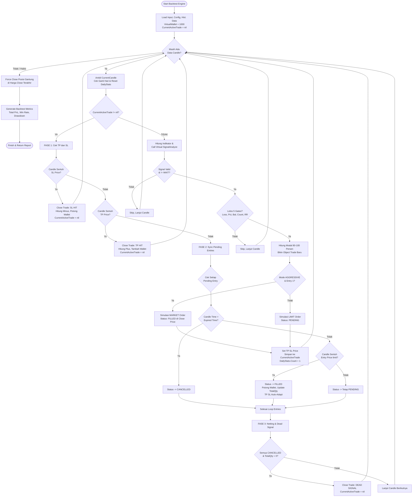

Flow ini sudah merangkum semua logika dari *live system* kamu: **Signal Analyze**, **Trade Execute (5 Gates)**, dan update terbaru dari **Trade Monitor (Auto-Adapt TP/SL dengan `closePosition=true` & *Dead Signal Detection*)**, yang disesuaikan khusus untuk *backtest* **1 Symbol, 1 Strategy, dan default Balance 1000**.

Berikut adalah alur hierarki teks utuh dan diagram Mermaid-nya.

### 📜 FLOW TEXT BACKTEST ENGINE (END-TO-END)

**1. INISIALISASI ENGINE & DATA**
* **1.1 Load Input & Config:**
    * Terima input: `Symbol`, `StrategyID`, dan `Balance` (default `1000.00` USDT).
    * Load Config Binance untuk `Symbol` tersebut (`TickSize`, `StepSize`, `MinNotional` = 5.0).
    * Load `MMConfig` dari `StrategyID` (`MAX_DAILY_TRADES`, `MAX_DAILY_LOSS_COUNT`, `MAX_DAILY_LOSS_PERCENT`, `MIN_CONFIDENCE`, `RISK_REWARD_TARGET`, `LEVERAGE`, jam *expired* order).
* **1.2 Tarik Historical Data:** Ambil semua data klines/candles untuk `Symbol` tersebut dari database, urutkan dari waktu terlama ke terbaru.
* **1.3 Setup Virtual State (Memory):**
    * `VirtualWallet` = `Balance`.
    * `CurrentActiveTrade` = `nil` (Karena cuma boleh 1 active trade per symbol).
    * `TradeHistory` = Array kosong (untuk menyimpan history trade yang sudah *Closed*).
    * `DailyStats` = Object tracker harian `{ Date, Count: 0, PnL: 0, SLHits: 0, TPHits: 0, ConsecutiveLosses: 0 }`.

**2. MAIN LOOP: ITERASI PER CANDLE (Masa Lalu ke Masa Depan)**
* **2.1 Ambil `CurrentCandle`:** Baca nilai Open, High, Low, Close, dan Timestamp.
* **2.2 Cek Pergantian Hari:**
    * Jika `CurrentCandle.Date` > `DailyStats.Date`: Reset `DailyStats.Count` = 0 dan `DailyStats.PnL` = 0. *(Catatan: `ConsecutiveLosses` tetap dipertahankan, jangan di-reset agar streak loss terbaca)*.

* **2.3 REPLIKA TRADE MONITOR (JIKA `CurrentActiveTrade != nil`)**
    * **2.3.1 FASE 1: Cek TP / SL (Prioritas SL - Pesimis)**
        * *Cek Stop Loss (SL):*
            * Jika posisi LONG & `CurrentCandle.Low` <= `SLPrice` ATAU
            * Jika posisi SHORT & `CurrentCandle.High` >= `SLPrice`
            * *Eksekusi SL:* Hitung kerugian berdasarkan `TotalQty`. Kurangi `VirtualWallet` (termasuk fee taker). Update `DailyStats` (`ConsecutiveLosses` + 1, `SLHits` + 1, kurangi PnL harian). Ubah status jadi `SL_HIT`, masukkan ke `TradeHistory`. Set `CurrentActiveTrade = nil`. **Lanjut ke candle berikutnya (Skip step di bawah).**
        * *Cek Take Profit (TP):*
            * Jika posisi LONG & `CurrentCandle.High` >= `TPPrice` ATAU
            * Jika posisi SHORT & `CurrentCandle.Low` <= `TPPrice`
            * *Eksekusi TP:* Hitung profit berdasarkan `TotalQty`. Tambah ke `VirtualWallet` (dikurangi fee taker). Update `DailyStats` (Reset `ConsecutiveLosses` = 0, `TPHits` + 1, tambah PnL harian). Ubah status jadi `TP_HIT`, masukkan ke `TradeHistory`. Set `CurrentActiveTrade = nil`. **Lanjut ke candle berikutnya (Skip step di bawah).**
    * **2.3.2 FASE 2: Sync Pending Entries (Jaring Limit Order)**
        * Loop setiap `Entry` di `CurrentActiveTrade.Entries` yang berstatus `PENDING`:
            * *Cek Expired:* Jika `CurrentCandle.Timestamp` > `(CreatedAt + jam_expired)`, ubah status entry jadi `CANCELLED`.
            * *Cek Terjemput:* * Jika LONG & `CurrentCandle.Low` <= `EntryPrice` ATAU
                * Jika SHORT & `CurrentCandle.High` >= `EntryPrice`
                * *Eksekusi FILLED:* Ubah status entry jadi `FILLED`. Hitung Notional Value, pastikan > `MinNotional`. Potong modal dari `VirtualWallet`. 
                * *Auto-Adapt TP/SL:* Tambahkan qty baru ke `TotalQty` parent trade, hitung ulang `AvgEntryPrice`. *(Tidak perlu cancel/create TP/SL karena menggunakan logic closePosition=true).*
    * **2.3.3 FASE 3: Netting & Dead Signal Check**
        * Cek apakah semua *Entries* berstatus `CANCELLED` (tidak ada yang `FILLED`).
        * Jika YA: Ini adalah *Dead Signal*. Ubah status parent trade jadi `CANCELLED` (Reason: `DEAD_SIGNAL`). Masukkan ke `TradeHistory`. Set `CurrentActiveTrade = nil`.
        * *(Selesai fase monitor, lanjut ke candle berikutnya).*

* **2.4 REPLIKA TRADE EXECUTE & SIGNAL ANALYZE (JIKA `CurrentActiveTrade == nil`)**
    * **2.4.1 Virtual Signal Analyze:** Update kalkulasi indikator (TA) menggunakan data sampai `CurrentCandle.Close`. Dapatkan *Trading Plan* (Mode, Entries, Target TP/SL, R:R, Strength).
    * **2.4.2 Validasi 5 Gates:**
        * *Validasi Dasar:* Apakah Signal Valid & Bukan "WAIT"? (Jika tidak -> Skip, lanjut candle berikutnya).
        * *Gate 1 (Active Trade):* Otomatis Lolos (karena CurrentActiveTrade = nil).
        * *Gate 2A (Consecutive Loss):* Lolos jika `DailyStats.ConsecutiveLosses` < `MAX_DAILY_LOSS_COUNT`.
        * *Gate 2B (Daily Loss Pct):* Lolos jika absolut `DailyStats.PnL` (jika minus) < (`VirtualWallet` * `MAX_DAILY_LOSS_PERCENT`).
        * *Gate 3 (Balance):* Lolos jika (`VirtualWallet` * 0.98) >= 3.0 USDT.
        * *Gate 5 (Daily Count):* Lolos jika `DailyStats.Count` < `MAX_DAILY_TRADES` **ATAU** `RiskRewardRatio` >= `RISK_REWARD_TARGET`.
        * *(Jika gagal salah satu Gate -> Skip, lanjut candle berikutnya).*
    * **2.4.3 Eksekusi Virtual Order:**
        * Hitung `CapitalAllocation` = % Strength Signal (80% atau 100%) dari (Max Position Size * VirtualWallet).
        * Buat object `CurrentActiveTrade` baru (Status: `ACTIVE`, `TotalQty`: 0).
        * Loop setiap `Entry` dari Trading Plan:
            * Lakukan *Adjust Precision* untuk harga dan kuantitas.
            * Jika Mode `AGGRESSIVE` & `EntryNumber` == 1:
                * Eksekusi MARKET: Status langsung `FILLED` di harga `CurrentCandle.Close`. Potong `VirtualWallet`. Tambahkan ke `TotalQty`.
            * Selain itu (Mode `CONSERVATIVE` atau `EntryNumber` > 1):
                * Eksekusi LIMIT: Status `PENDING` di harga yang ditentukan *Signal*.
        * Set `TPPrice` dan `SLPrice` di object `CurrentActiveTrade`.
        * Update `DailyStats.Count` + 1.

**3. FINALISASI & REPORTING**
* **3.1 Force Close:** Setelah loop semua *candle* selesai, jika `CurrentActiveTrade != nil` (masih ada posisi gantung yang belum kena TP/SL), lakukan *Close* paksa di harga *Close* pada *candle* paling terakhir. Hitung PnL final, kembalikan ke `VirtualWallet`, dan catat ke `TradeHistory`.
* **3.2 Generate Metrics:** Hitung Total Net Profit, Win Rate, Max Drawdown, dan Total Executed Trades dari data `TradeHistory`.
* **3.3 Return Result:** Kembalikan `BacktestReport` JSON ke user.

---

### 📊 DIAGRAM MERMAID END-TO-END

Konsep `closePosition=true` (Auto-adapt TP/SL) ditangani secara *native* karena engine hanya mengupdate nilai `TotalQty` saat *limit entry* ke-2/3 kena, dan engine akan selalu pakai `TotalQty` yang paling *fresh* saat nanti mengecek PnL di FASE 1.