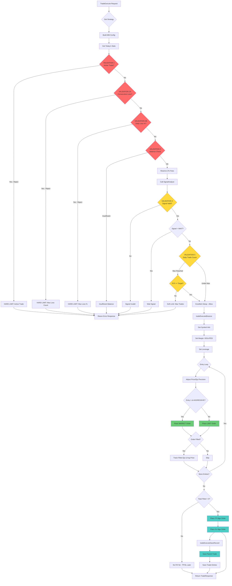

# Trade Execute Flow Documentation

## 📋 Table of Contents

1. [Overview](#overview)
2. [Trade Execute Architecture](#trade-execute-architecture)
3. [Main Flow Diagram](#main-flow-diagram)
4. [Phase 1: Strategy & Statistics](#phase-1-strategy--statistics)
5. [Phase 2: Validation Layer (5 Gate Checks)](#phase-2-validation-layer-5-gate-checks)
6. [Phase 3: Binance Execution](#phase-3-binance-execution)
7. [Phase 4: Database Recording](#phase-4-database-recording)
8. [Function Breakdown](#function-breakdown)
9. [Status & Messages Reference](#status--messages-reference)
10. [Edge Cases & Error Handling](#edge-cases--error-handling)

---

## 🌐 Overview

**Trade Execute** adalah core function yang bertanggung jawab untuk:
- ✅ Validasi trading signal dengan risk management rules
- ✅ Eksekusi order ke Binance Futures API
- ✅ Setup margin mode & leverage
- ✅ Place entry orders (Market/Limit)
- ✅ Place TP/SL algo orders
- ✅ Record trade ke database

**Location:** `internal/service/trade_execute_service.go`

**Trigger:** Automated (cron job) atau Manual (API call)

---

## 🏗️ Trade Execute Architecture

### **Main Functions**

```
TradeExecute()                          ← Entry point
    ↓
    ├─ 1. Get Strategy & Build MM Config
    ├─ 2. tradeExecuteTodayStat()       ← Get today's statistics
    ├─ 3. Validation Layer (5 gates)
    ├─ 4. SignalAnalyze()               ← Get trading signal
    └─ 5. tradeExecuteBinance()         ← Execute orders
            ↓
            ├─ GetSymbolInfo()
            ├─ SetMarginMode()
            ├─ SetLeverage()
            ├─ PlaceOrder() [Loop entries]
            ├─ PlaceAlgoOrder() [TP/SL]
            └─ tradeExecuteSaveRecord()
```

### **Supporting Functions**

| Function | Purpose | Location |
|----------|---------|----------|
| `tradeExecuteTodayStat()` | Calculate today's trading statistics | `trade_execute_service.go` |
| `tradeExecuteBinance()` | Execute orders to Binance | `trade_execute_service.go` |
| `tradeExecuteSaveRecord()` | Save trade to database | `trade_execute_service.go` |
| `convertAnalyzeResToJSONMap()` | Convert signal to JSON for DB | `trade_execute_service.go` |

### **Binance Client Functions Used**

| Function | Purpose | Location |
|----------|---------|----------|
| `GetSymbolInfo()` | Get symbol precision & limits | `clients/binance/service.go` |
| `GetBalance()` | Get USDT balance | `clients/binance/service.go` |
| `SetMarginMode()` | Set ISOLATED/CROSSED margin | `clients/binance/service.go` |
| `SetLeverage()` | Set leverage (1-125x) | `clients/binance/service.go` |
| `PlaceOrder()` | Place market/limit order | `clients/binance/service.go` |
| `PlaceAlgoOrder()` | Place TP/SL algo order | `clients/binance/service.go` |

---

## 🔄 Main Flow Diagram



---

## 📊 Phase 1: Strategy & Statistics

### **Step 1.1: Get Strategy**

**Purpose:** Mengambil strategy yang akan digunakan untuk trading

**Logic:**
```go
if req.StrategyID > 0 {
    strategy = StrategyGetByID(req.StrategyID)  // Manual select
} else {
    strategy = StrategyGetActive()              // Auto select active
}
```

**Possible Outcomes:**
| Scenario | Result |
|----------|--------|
| StrategyID provided & exists | ✅ Use specified strategy |
| StrategyID = 0 | ✅ Use active strategy |
| Strategy not found | ❌ Error: "failed to get active strategy" |

---

### **Step 1.2: Build MM Config**

**Purpose:** Mengkonversi strategy parameters ke Money Management config

**Config Mapping:**
```go
mmConfig := {
    MAX_DAILY_TRADES:        strategy.MaxDailyTrades,
    MAX_DAILY_LOSS_COUNT:    strategy.MaxConsecutiveLoss,
    MAX_DAILY_LOSS_PERCENT:  strategy.MaxDailyLossPercent,
    MIN_CONFIDENCE:          strategy.MinConfidence,
    RISK_REWARD_TARGET:      strategy.RiskRewardTarget,
    LEVERAGE:                strategy.Leverage,
}
```

---

### **Step 1.3: Get Today's Statistics**

**Function:** `tradeExecuteTodayStat(symbol string)`

**Purpose:** Menghitung statistik trading hari ini untuk symbol tertentu

**Statistics Calculated:**

| Stat | Description | Calculation |
|------|-------------|-------------|
| `Active` | Active trades count | Count trades with status ACTIVE/PENDING/PARTIAL |
| `Count` | Total trades today | Count all non-cancelled trades |
| `PnL` | Total PnL today | Sum(PnL) from CLOSED/FINISHED trades |
| `SLHits` | Loss count | Count trades with PnL < 0 |
| `TPHits` | Win count | Count trades with PnL > 0 |
| `ConsecutiveLossess` | Current loss streak | Count consecutive losses from newest trades |
| `TotalProfit` | Sum of losses | Sum(PnL) for losing trades (negative) |
| `TotalLoss` | Sum of wins | Sum(PnL) for winning trades (positive) |

**Database Query:**
```sql
SELECT * FROM trades 
WHERE DATE(created_at) = CURDATE()
ORDER BY created_at DESC  -- Newest first for consecutive check
```

**Consecutive Loss Logic:**
```go
countConsecutive := true
for _, trade := range todaysTrades {
    if trade.PnL < 0 {
        ConsecutiveLossess++  // Continue counting
    } else if trade.PnL > 0 {
        countConsecutive = false  // Stop counting (break streak)
    }
}
```

**Example:**
```
Today's Trades (newest to oldest):
1. BTCUSDT: -$50 (Loss)  ← ConsecutiveLossess = 1
2. ETHUSDT: -$30 (Loss)  ← ConsecutiveLossess = 2
3. BTCUSDT: +$100 (Win)  ← Stop counting (ConsecutiveLossess = 2)
4. SOLUSDT: -$20 (Loss)  ← Not counted
```

---

## 🚧 Phase 2: Validation Layer (5 Gate Checks)

### **VALIDATION 1: Active Trade Check** 🔴 HARD LIMIT

**Purpose:** Prevent multiple active trades on same symbol

**Condition:**
```go
if symStat.Active > 0 {
    return "HARD LIMIT: Symbol %s already has an active trade. Only 1 active trade permitted."
}
```

**Checked Status:**
- `ACTIVE`
- `PENDING`
- `PARTIAL`

**Response:**
```json
{
  "Symbol": "BTCUSDT",
  "ExecutionInfo": {
    "Executed": false,
    "Message": "HARD LIMIT: Symbol BTCUSDT already has an active trade. Only 1 active trade permitted."
  }
}
```

---

### **VALIDATION 2A: Consecutive Loss Check** 🔴 HARD LIMIT

**Purpose:** Stop trading after consecutive losses (prevent revenge trading)

**Condition:**
```go
if mmConfig.MAX_DAILY_LOSS_COUNT > 0 && int(symStat.SLHits) >= int(mmConfig.MAX_DAILY_LOSS_COUNT) {
    return "HARD LIMIT: Reached max consecutive loss (%d). Cooling down."
}
```

**Example:**
```
Config: MAX_DAILY_LOSS_COUNT = 3
Today:  SLHits = 3

Result: ❌ REJECTED - "HARD LIMIT: Reached max consecutive loss (3). Cooling down."
```

**Response:**
```json
{
  "Symbol": "BTCUSDT",
  "ExecutionInfo": {
    "Executed": false,
    "Message": "HARD LIMIT: Reached max consecutive loss (3). Cooling down."
  }
}
```

---

### **VALIDATION 2B: Daily Loss Percentage Check** 🔴 HARD LIMIT

**Purpose:** Stop trading if daily loss exceeds percentage of wallet

**Condition:**
```go
if mmConfig.MAX_DAILY_LOSS_PERCENT > 0 && symStat.PnL < 0 {
    lossPctDec := float64(mmConfig.MAX_DAILY_LOSS_PERCENT)  // e.g., 0.05 = 5%
    if math.Abs(symStat.PnL) >= (totalWalletUsdt * lossPctDec) {
        return "HARD LIMIT: Reached max daily loss percentage..."
    }
}
```

**Example:**
```
Config: MAX_DAILY_LOSS_PERCENT = 0.05 (5%)
Wallet: $1000 USDT
Today:  PnL = -$60

Calculation: |-$60| >= ($1000 × 0.05)
             $60 >= $50
Result: ❌ REJECTED
```

**Response:**
```json
{
  "Symbol": "BTCUSDT",
  "ExecutionInfo": {
    "Executed": false,
    "Message": "HARD LIMIT: Reached max daily loss percentage (Total PnL: -60.00 on 1000.00 Bal). Cooling down."
  }
}
```

---

### **VALIDATION 3: Balance & Capital Check** 🔴 HARD LIMIT

**Purpose:** Ensure sufficient balance for trading

**Steps:**
```go
// 3.1: Fetch balance from Binance
balanceInfo = BinanceClient.GetBalance("USDT")

// 3.2: Reserve 2% for fees
availableUsdt = balanceInfo.AvailableBalance × (1 - 0.02)

// 3.3: Minimum balance check
if availableUsdt < 3.0 {
    return "Insufficient total wallet balance..."
}
```

**Fee Reserve Calculation:**
```
Available Balance: $100 USDT
Fee Reserve (2%):  $2 USDT
Usable Capital:    $98 USDT
```

**Minimum Balance:**
```
Required: 3.0 USDT
If below: ❌ REJECTED
```

**Response (Insufficient):**
```json
{
  "Symbol": "BTCUSDT",
  "ExecutionInfo": {
    "Executed": false,
    "Message": "Insufficient total wallet balance. Requires at least 3.0 USDT, but got 2.50 USDT"
  }
}
```

---

### **VALIDATION 4: Signal Analysis** 🟡 SOFT LIMIT

**Purpose:** Validate trading signal confidence

**Steps:**
```go
// 4.1: Build analyze request
analyzeReq = {
    Symbol:     req.Symbol,
    StrategyID: strategy.ID,
    Capital:    availableUsdtWithFeesReserve,  // 98% of available
}

// 4.2: Call SignalAnalyze
analyzeRes, err = SignalAnalyze(analyzeReq)

// 4.3: Check confidence
if !analyzeRes.Signal.Valid {
    return "Signal invalid: Confidence(%.2f) under threshold(%d)"
}

// 4.4: Check signal direction
if analyzeRes.Signal.Signal == "WAIT" {
    return "Signal result is WAIT. No trade taken."
}
```

**Signal Valid Criteria:**
- `Confidence >= MIN_CONFIDENCE` (from MM config)
- `Signal != "WAIT"`

**Possible Signals:**
| Signal | Description | Action |
|--------|-------------|--------|
| `STRONG_BUY` | High confidence buy | ✅ Proceed |
| `BUY` | Moderate confidence buy | ✅ Proceed |
| `STRONG_SELL` | High confidence sell | ✅ Proceed |
| `SELL` | Moderate confidence sell | ✅ Proceed |
| `WAIT` | No clear direction | ❌ Reject |

**Response (Invalid Signal):**
```json
{
  "Symbol": "BTCUSDT",
  "Signal": {
    "Signal": "BUY",
    "Valid": false
  },
  "Scoring": {
    "Confidence": 45,
    "TotalScore": 60
  },
  "ExecutionInfo": {
    "Executed": false,
    "Message": "Signal invalid: Confidence(45.00) under threshold(60)"
  }
}
```

**Response (WAIT):**
```json
{
  "Symbol": "BTCUSDT",
  "Signal": {
    "Signal": "WAIT"
  },
  "ExecutionInfo": {
    "Executed": false,
    "Message": "Signal result is WAIT. No trade taken."
  }
}
```

---

### **VALIDATION 5: Daily Trade Count & R:R Override** 🟡 SOFT LIMIT

**Purpose:** Limit daily trades but allow exception for excellent setups

**Condition:**
```go
if symStat.Count >= mmConfig.MAX_DAILY_TRADES {
    isExcellentSetup := analyzeRes.Signal.TradingPlan.RiskRewardRatio >= mmConfig.RISK_REWARD_TARGET
    
    if !isExcellentSetup {
        return "SOFT LIMIT: Max daily trades (%d) reached. Rejected because R:R %.2f is lower than TARGET %.2f"
    }
}
```

**Logic:**
```
Scenario A: Normal Setup
- Daily Trades: 5/5 (MAX reached)
- R:R Ratio: 1.8
- R:R Target: 2.5
- Result: ❌ REJECTED (R:R < Target)

Scenario B: Excellent Setup
- Daily Trades: 5/5 (MAX reached)
- R:R Ratio: 3.2
- R:R Target: 2.5
- Result: ✅ ALLOWED (Exception for excellent R:R)
```

**Response (Max Trades):**
```json
{
  "Symbol": "BTCUSDT",
  "Signal": {
    "TradingPlan": {
      "RiskRewardRatio": 1.8
    }
  },
  "ExecutionInfo": {
    "Executed": false,
    "Message": "SOFT LIMIT: Max daily trades (5) reached. Rejected because R:R 1.80 is lower than TARGET 2.50 for exception."
  }
}
```

---

## 🚀 Phase 3: Binance Execution

**Function:** `tradeExecuteBinance()`

**Purpose:** Execute orders to Binance Futures API

### **Step 3.1: Determine Side**

```go
side := binance.OrderSideBuy
if analyzeRes.Signal.Signal == "SELL" || analyzeRes.Signal.Signal == "STRONG_SELL" {
    side = binance.OrderSideSell
}
```

---

### **Step 3.2: Get Symbol Info**

**Binance API Call:** `GetSymbolInfo(symbol)`

**Purpose:** Get precision and trading rules

**Returned Info:**
```go
SymbolInfo {
    Symbol:              "BTCUSDT"
    TickSize:            0.01          // Price precision
    StepSize:            0.001         // Quantity precision
    MinNotional:         5.0           // Minimum order value ($5 USDT)
    PricePrecision:      2
    QuantityPrecision:   3
    MaxLeverage:         125
    MinLeverage:         1
}
```

**Caching:**
- Exchange info cached in Redis for **1 week**
- Symbol info derived from exchange info

**Error Handling:**
```go
if err != nil {
    return fmt.Errorf("failed to fetch symbol info %s: %w", symbol, err)
}
```

---

### **Step 3.3: Set Margin Mode**

**Binance API Call:** `SetMarginMode(MarginModeRequest)`

**Purpose:** Set ISOLATED margin mode for safer risk management

**Request:**
```go
MarginModeRequest {
    Symbol:     "BTCUSDT"
    MarginMode: 1  // 1 = ISOLATED, 2 = CROSSED
}
```

**Caching:**
- Margin mode cached in Redis for **30 days**
- Same request skipped if already set

**Error Handling:**
```go
if err != nil {
    errMsg := err.Error()
    // Ignore "No need to change margin type" error (-4046)
    if !strings.Contains(errMsg, "-4046") && !strings.Contains(errMsg, "No need to change margin type") {
        return fmt.Errorf("failed to set margin mode to ISOLATED: %w", err)
    }
    // Error ignored successfully
}
```

**Response:**
```go
MarginModeResponse {
    Symbol:     "BTCUSDT"
    MarginMode: 1  // ISOLATED
}
```

---

### **Step 3.4: Set Leverage**

**Binance API Call:** `SetLeverage(LeverageRequest)`

**Purpose:** Set leverage for the symbol

**Request:**
```go
LeverageRequest {
    Symbol:   "BTCUSDT"
    Leverage: 10  // From MM config
}
```

**Validation:**
```go
// Validate against symbol limits
if leverage < MinLeverage || leverage > MaxLeverage {
    return fmt.Errorf("leverage must be between %d and %d", MinLeverage, MaxLeverage)
}
```

**Caching:**
- Leverage cached in Redis for **3 days**
- Same request skipped if already set

**Response:**
```go
LeverageResponse {
    Symbol:      "BTCUSDT"
    Leverage:    10
    MaxNotional: 100000  // Maximum position value
}
```

---

### **Step 3.5: Execute Entry Orders (Loop)**

**Purpose:** Place entry orders based on trading plan

**Loop Logic:**
```go
for _, entry := range tpPlan.Entries {
    // 1. Adjust precision
    adjustedPrice = AdjustPricePrecision(entry.EntryPrice, TickSize)
    adjustedQty = AdjustQuantityPrecision(entry.PositionQty, StepSize)
    
    // 2. Determine order type
    orderType = LIMIT
    if entry.EntryNumber == 1 && tpPlan.Mode == "AGGRESSIVE" {
        orderType = MARKET
    }
    
    // 3. Place order
    orderResponse = PlaceOrder(reqOrder)
    
    // 4. Track filled
    if orderResponse.Status == "FILLED" || orderResponse.Status == "PARTIALLY_FILLED" {
        totalFilledQty += ExecutedQuantity
        avgEntryPriceSum += (AveragePrice × ExecutedQuantity)
    }
}
```

**Order Type Decision:**

| Entry # | Mode | Order Type | Reason |
|---------|------|------------|--------|
| 1 | AGGRESSIVE | MARKET | Fast entry, prioritize execution |
| 1 | CONSERVATIVE | LIMIT | Wait for price, better fill |
| 2+ | Any | LIMIT | Average at specific levels |

**Precision Adjustment:**

```go
// Price: Round to tick size (e.g., 0.01)
adjustedPrice = math.Round(price / tickSize) * tickSize

// Quantity: Round to step size (e.g., 0.001)
adjustedQty = math.Round(qty / stepSize) * stepSize
```

**Example:**
```
Raw Entry:
  Price: 50123.456789
  Qty:   0.123456789

Adjusted (BTCUSDT):
  TickSize:  0.01
  StepSize:  0.001
  
  Price: 50123.46  (rounded to 2 decimals)
  Qty:   0.123     (rounded to 3 decimals)
```

**Min Notional Validation:**
```go
notionalValue = adjustedQty × adjustedPrice
if notionalValue < MinNotional (5.0 USDT) {
    return fmt.Errorf("order value %.2f USDT below min notional %.2f USDT", notionalValue, MinNotional)
}
```

**Order Placement:**

**LIMIT Order:**
```go
PlaceOrderRequest {
    Symbol:      "BTCUSDT"
    Side:        "BUY"
    Type:        "LIMIT"
    Quantity:    0.123
    Price:       50123.46
    TimeInForce: "GTC"  // Good Till Cancel
}
```

**MARKET Order:**
```go
PlaceOrderRequest {
    Symbol:   "BTCUSDT"
    Side:     "BUY"
    Type:     "MARKET"
    Quantity: 0.123
    // No price (market execution)
}
```

**Order Response:**
```go
OrderResponse {
    OrderID:          123456789
    Symbol:           "BTCUSDT"
    Status:           "FILLED"  // or "NEW", "PARTIALLY_FILLED"
    Price:            50123.46
    AveragePrice:     50123.50  // Actual fill price
    OrigQuantity:     0.123
    ExecutedQuantity: 0.123     // Filled amount
    Type:             "LIMIT"
    Side:             "BUY"
    UpdateTime:       1234567890
}
```

**Error Handling:**
```go
if err != nil {
    if entry.EntryNumber == 1 {
        // First order failed → Abort entire trade
        return fmt.Errorf("failed to place entry order #%d: %w", entry.EntryNumber, err)
    }
    // Subsequent orders failed → Continue with next
    continue
}
```

---

### **Step 3.6: Place TP/SL Orders (Algo Orders)**

**Purpose:** Place Take Profit and Stop Loss orders using Binance Algo API

**Condition:**
```go
if totalFilledQty > 0 {
    // Only place TP/SL if entries are filled
} else {
    // No entries filled yet - TP/SL will be placed later
    fmt.Printf("Info: No entries filled yet for %s. TP/SL will be placed after fill.\n", symbol)
}
```

**Determine Close Side:**
```go
var closeSide binance.OrderSide
if side == binance.OrderSideBuy {
    closeSide = binance.OrderSideSell  // Close LONG with SELL
} else {
    closeSide = binance.OrderSideBuy   // Close SHORT with BUY
}
```

**TP/SL Price Adjustment:**
```go
tpAdjusted = AdjustPricePrecision(tpPlan.TakeProfit, TickSize)
slAdjusted = AdjustPricePrecision(tpPlan.StopLoss, TickSize)
```

**Take Profit Order (Algo):**
```go
PlaceAlgoOrderRequest {
    Symbol:        "BTCUSDT"
    Side:          "SELL"  // Close LONG
    Type:          "TAKE_PROFIT_MARKET"
    TriggerPrice:  52000.00
    ClosePosition: true  // Close entire position
}
```

**Stop Loss Order (Algo):**
```go
PlaceAlgoOrderRequest {
    Symbol:        "BTCUSDT"
    Side:          "SELL"  // Close LONG
    Type:          "STOP_MARKET"
    TriggerPrice:  48000.00
    ClosePosition: true  // Close entire position
}
```

**Algo Order Response:**
```go
PlaceAlgoOrderResponse {
    AlgoID: 99001  // Unique algo order ID
    Status: "WORKING"
}
```

**Error Handling:**
```go
tpResp, err := BinanceClient.PlaceAlgoOrder(tpReq)
if err == nil && tpResp.AlgoID > 0 {
    tpOrderID = tpResp.AlgoID
} else if err != nil {
    fmt.Printf("Warning: Failed to place TP for %s: %v\n", symbol, err)
    // Continue with SL placement
}
```

**Important Notes:**
- TP/SL are **Algo Orders** (not regular limit/market orders)
- `ClosePosition: true` ensures entire position is closed
- TP/SL only placed if **at least one entry is filled**
- Failed TP/SL placement doesn't abort trade (warning logged)

---

## 💾 Phase 4: Database Recording

**Function:** `tradeExecuteSaveRecord()`

**Purpose:** Save trade to database with transaction safety

### **Step 4.1: Calculate Risk Reward Ratio**

```go
rrRatio := tpPlan.RiskRewardRatio
if rrRatio == 0 {
    diffTP := math.Abs(tpPlan.TakeProfit - avgEntryPrice)
    diffSL := math.Abs(avgEntryPrice - tpPlan.StopLoss)
    if diffSL > 0 {
        rrRatio = diffTP / diffSL
    }
}
```

**Example:**
```
Avg Entry:   $50,000
Take Profit: $52,000
Stop Loss:   $48,000

diffTP = |52000 - 50000| = 2000
diffSL = |50000 - 48000| = 2000
R:R = 2000 / 2000 = 1.0
```

---

### **Step 4.2: Convert Signal to JSON**

```go
rawSignal := convertAnalyzeResToJSONMap(analyzeRes)
```

**Purpose:** Store complete signal analysis for audit trail

**Process:**
```go
// Marshal struct to JSON
b, err := json.Marshal(analyzeRes)

// Unmarshal to generic map
var jsonMap models.JSONMap
json.Unmarshal(b, &jsonMap)
```

---

### **Step 4.3: Save Parent Trade**

**Database Model:**
```go
models.Trade {
    Symbol:          "BTCUSDT"
    Interval:        "1h"
    Side:            "BUY"
    Confidence:      75.5
    TotalScore:      82.3
    RawSignal:       JSONMap{...}  // Full signal data
    IsAggressive:    true
    TPPrice:         52000.00
    SLPrice:         48000.00
    RiskRewardRatio: 1.0
    AvgEntryPrice:   50123.50
    Leverage:        10
    CapitalUsed:     500.00
    TotalQty:        0.123
    Status:          "ACTIVE"
    TPOrderID:       99001
    SLOrderID:       99002
}
```

**Transaction:**
```go
_, err = repo.TxManager.WithinTransactionWithResult(func(tx *gorm.DB) (interface{}, error) {
    savedTrade, err = repo.Trade.Create(tx, parentTrade)
    if err != nil {
        return nil, err
    }
    
    // Save entries...
    return savedTrade, nil
})
```

---

### **Step 4.4: Save Trade Entries**

**Database Model:**
```go
models.TradeEntry {
    TradeID:        123
    EntryNumber:    1
    EntryPrice:     50123.46
    EntryType:      "MARKET"  // or "LIMIT"
    PositionSize:   "50%"
    PositionValue:  250.00
    PositionQty:    0.0615
    BinanceOrderID: 123456789
    BinanceStatus:  "FILLED"
    Status:         "FILLED"  // or "PENDING"
    FilledPrice:    50123.50
    FilledQty:      0.0615
    FilledAt:       time.Now()
}
```

**Status Mapping:**
| Binance Status | DB Status |
|----------------|-----------|
| `NEW` | `PENDING` |
| `FILLED` | `FILLED` |
| `PARTIALLY_FILLED` | `PENDING` |

**Entry Loop:**
```go
for _, eo := range executedOrders {
    // Find original plan info
    for _, planned := range tpPlan.Entries {
        if planned.EntryNumber == eo.EntryNumber {
            posSizeStr = planned.PositionSize
            posValue = planned.PositionValue
            break
        }
    }
    
    // Determine status
    entryStat := "PENDING"
    if eo.Status == "FILLED" {
        entryStat = "FILLED"
    }
    
    // Create entry
    entry := &models.TradeEntry{...}
    if entryStat == "FILLED" {
        now := time.Now()
        entry.FilledPrice = eo.Price
        entry.FilledQty = eo.Quantity
        entry.FilledAt = &now
    }
    
    repo.TradeEntry.Create(tx, entry)
}
```

---

## 📚 Function Breakdown

### **1. TradeExecute()**

**Location:** `internal/service/trade_execute_service.go`

**Signature:**
```go
func (s *Services) TradeExecute(ctx *gin.Context, req *dtos.TradeRequest) (*dtos.TradeResponse, error)
```

**Responsibilities:**
1. Get strategy (by ID or active)
2. Build MM config
3. Get today's statistics
4. Run 5 validation gates
5. Call SignalAnalyze
6. Call tradeExecuteBinance (if all validations pass)

**Returns:**
```go
TradeResponse {
    Symbol:           "BTCUSDT"
    PrimaryTimeframe: "1h"
    Timestamp:        time.Now()
    Signal:           SignalData{...}
    Scoring:          ScoringData{...}
    ExecutionInfo:    ExecutionInfo{...}
}
```

---

### **2. tradeExecuteTodayStat()**

**Location:** `internal/service/trade_execute_service.go`

**Signature:**
```go
func (s *Services) tradeExecuteTodayStat(symbol string) dtos.TradeDayStat
```

**Responsibilities:**
1. Query today's trades from DB
2. Calculate statistics per symbol
3. Track consecutive losses

**Returns:**
```go
TradeDayStat {
    Active:             1
    Count:             5
    PnL:              -50.00
    SLHits:            3
    TPHits:            2
    ConsecutiveLossess: 2
    TotalProfit:      -150.00
    TotalLoss:        100.00
}
```

---

### **3. tradeExecuteBinance()**

**Location:** `internal/service/trade_execute_service.go`

**Signature:**
```go
func (s *Services) tradeExecuteBinance(
    ctx *gin.Context,
    symbol string,
    config *config.MMConfig,
    analyzeRes *dtos.SignalAnalyzeResponse,
    capitalUsed float64,
) (*dtos.TradeResponse, error)
```

**Responsibilities:**
1. Get symbol info
2. Set margin mode (ISOLATED)
3. Set leverage
4. Place entry orders (loop)
5. Place TP/SL algo orders
6. Call tradeExecuteSaveRecord

**Returns:**
```go
TradeResponse {
    Symbol:           "BTCUSDT"
    ExecutionInfo:    ExecutionInfo{
        Executed:    true
        Message:     "Trade successfully executed"
        MarginType:  "ISOLATED"
        Leverage:    10
        CapitalUsed: 500.00
        Orders:      []OrderInfo{...}
        TPOrderID:   99001
        SLOrderID:   99002
    }
}
```

---

### **4. tradeExecuteSaveRecord()**

**Location:** `internal/service/trade_execute_service.go`

**Signature:**
```go
func (s *Services) tradeExecuteSaveRecord(
    symbol string,
    side binance.OrderSide,
    tpPlan *dtos.TradingPlan,
    analyzeRes *dtos.SignalAnalyzeResponse,
    capitalUsed float64,
    leverage float64,
    executedOrders []dtos.OrderInfo,
    tpOrderID, slOrderID int64,
    avgEntryPrice float64,
    totalQty float64,
) error
```

**Responsibilities:**
1. Calculate R:R ratio
2. Convert signal to JSON
3. Save parent trade (with transaction)
4. Save trade entries (with transaction)

**Returns:** `error` (nil if success)

---

### **5. convertAnalyzeResToJSONMap()**

**Location:** `internal/service/trade_execute_service.go`

**Signature:**
```go
func (s *Services) convertAnalyzeResToJSONMap(analyzeRes *dtos.SignalAnalyzeResponse) models.JSONMap
```

**Responsibilities:**
1. Marshal SignalAnalyzeResponse to JSON
2. Unmarshal to generic JSONMap

**Returns:** `models.JSONMap`

---

### **6. Binance Client Functions**

#### **GetSymbolInfo()**

**Location:** `internal/clients/binance/service.go`

**Signature:**
```go
func (c *Client) GetSymbolInfo(symbol string) (*SymbolInfo, error)
```

**Caching:** Redis (1 week for exchange info)

**Returns:**
```go
SymbolInfo {
    Symbol:            "BTCUSDT"
    TickSize:          0.01
    StepSize:          0.001
    MinNotional:       5.0
    PricePrecision:    2
    QuantityPrecision: 3
    MaxLeverage:       125
    MinLeverage:       1
}
```

---

#### **SetMarginMode()**

**Location:** `internal/clients/binance/service.go`

**Signature:**
```go
func (c *Client) SetMarginMode(req *MarginModeRequest) (*MarginModeResponse, error)
```

**Caching:** Redis (30 days)

**Request:**
```go
MarginModeRequest {
    Symbol:     "BTCUSDT"
    MarginMode: 1  // 1=ISOLATED, 2=CROSSED
}
```

**Returns:**
```go
MarginModeResponse {
    Symbol:     "BTCUSDT"
    MarginMode: 1
}
```

---

#### **SetLeverage()**

**Location:** `internal/clients/binance/service.go`

**Signature:**
```go
func (c *Client) SetLeverage(req *LeverageRequest) (*LeverageResponse, error)
```

**Caching:** Redis (3 days)

**Request:**
```go
LeverageRequest {
    Symbol:   "BTCUSDT"
    Leverage: 10
}
```

**Validation:**
```go
if leverage < MinLeverage || leverage > MaxLeverage {
    return ErrInvalidLeverage
}
```

**Returns:**
```go
LeverageResponse {
    Symbol:      "BTCUSDT"
    Leverage:    10
    MaxNotional: 100000
}
```

---

#### **PlaceOrder()**

**Location:** `internal/clients/binance/service.go`

**Signature:**
```go
func (c *Client) PlaceOrder(req *PlaceOrderRequest) (*OrderResponse, error)
```

**Request (LIMIT):**
```go
PlaceOrderRequest {
    Symbol:      "BTCUSDT"
    Side:        "BUY"
    Type:        "LIMIT"
    Quantity:    0.123
    Price:       50123.46
    TimeInForce: "GTC"
}
```

**Request (MARKET):**
```go
PlaceOrderRequest {
    Symbol:   "BTCUSDT"
    Side:     "BUY"
    Type:     "MARKET"
    Quantity: 0.123
}
```

**Returns:**
```go
OrderResponse {
    OrderID:          123456789
    Symbol:           "BTCUSDT"
    Status:           "FILLED"
    Price:            50123.46
    AveragePrice:     50123.50
    OrigQuantity:     0.123
    ExecutedQuantity: 0.123
    Type:             "LIMIT"
    Side:             "BUY"
}
```

**Validation:**
1. Quantity precision adjustment
2. Price precision adjustment
3. Min notional check ($5 USDT)

---

#### **PlaceAlgoOrder()**

**Location:** `internal/clients/binance/service.go` (assumed based on usage)

**Signature:**
```go
func (c *Client) PlaceAlgoOrder(ctx *gin.Context, req *PlaceAlgoOrderRequest) (*PlaceAlgoOrderResponse, error)
```

**Request (TP):**
```go
PlaceAlgoOrderRequest {
    Symbol:        "BTCUSDT"
    Side:          "SELL"
    Type:          "TAKE_PROFIT_MARKET"
    TriggerPrice:  52000.00
    ClosePosition: true
}
```

**Request (SL):**
```go
PlaceAlgoOrderRequest {
    Symbol:        "BTCUSDT"
    Side:          "SELL"
    Type:          "STOP_MARKET"
    TriggerPrice:  48000.00
    ClosePosition: true
}
```

**Returns:**
```go
PlaceAlgoOrderResponse {
    AlgoID: 99001
    Status: "WORKING"
}
```

---

## 📋 Status & Messages Reference

### **Execution Status**

| Status | Description | When |
|--------|-------------|------|
| `Executed: true` | Trade executed successfully | All validations passed, orders placed |
| `Executed: false` | Trade rejected | One or more validations failed |

---

### **Error Messages (Hard Limits)** 🔴

| Message | Trigger | Response Type |
|---------|---------|---------------|
| `"HARD LIMIT: Symbol %s already has an active trade. Only 1 active trade permitted."` | Active trade exists | `Executed: false` |
| `"HARD LIMIT: Reached max consecutive loss (%d). Cooling down."` | SLHits >= MAX_DAILY_LOSS_COUNT | `Executed: false` |
| `"HARD LIMIT: Reached max daily loss percentage (Total PnL: %.2f on %.2f Bal). Cooling down."` | |PnL| >= Wallet × MAX_DAILY_LOSS_PERCENT | `Executed: false` |
| `"Insufficient total wallet balance. Requires at least %.1f USDT, but got %.2f USDT"` | Available < 3.0 USDT | `Executed: false` |

---

### **Warning Messages (Soft Limits)** 🟡

| Message | Trigger | Response Type |
|---------|---------|---------------|
| `"Signal invalid: Confidence(%.2f) under threshold(%d)"` | Confidence < MIN_CONFIDENCE | `Executed: false` |
| `"Signal result is WAIT. No trade taken."` | Signal = "WAIT" | `Executed: false` |
| `"SOFT LIMIT: Max daily trades (%d) reached. Rejected because R:R %.2f is lower than TARGET %.2f for exception."` | Count >= MAX & R:R < Target | `Executed: false` |

---

### **Success Messages** ✅

| Message | Trigger |
|---------|---------|
| `"Trade successfully executed"` | All orders placed successfully |

---

### **Debug Logs** 📝

```go
fmt.Printf("[DEBUG] MAX_DAILY_TRADES = %d, RISK_REWARD_TARGET = %.2f\n", ...)
fmt.Printf("[DEBUG] symStat.Count = %d, symStat.Active = %d, Symbol = %s\n", ...)
fmt.Printf("[DEBUG] analyzeRes.Signal.TradingPlan.RiskRewardRatio = %.2f\n", ...)
```

---

### **Warning Logs** ⚠️

```go
fmt.Printf("Warning: Failed to place TP for %s: %v\n", symbol, err)
fmt.Printf("Warning: Failed to place SL for %s: %v\n", symbol, err)
fmt.Printf("Warning: Trade executed but DB tracking failed: %v", err)
fmt.Printf("Warning: failed to marshal analyze result: %v\n", err)
fmt.Printf("Warning: failed to unmarshal analyze result to JSONMap: %v\n", err)
```

---

### **Info Logs** ℹ️

```go
fmt.Printf("Info: No entries filled yet for %s. TP/SL will be placed after fill.\n", symbol)
```

---

## 🚨 Edge Cases & Error Handling

### **Edge Case 1: First Entry Order Fails**

**Scenario:**
```
Entry 1 (MARKET): FAILED (API error, insufficient margin, etc.)
Entry 2 (LIMIT):  Not placed
```

**Handling:**
```go
if err != nil {
    if entry.EntryNumber == 1 {
        // First order failed → Abort entire trade
        return fmt.Errorf("failed to place entry order #%d: %w", entry.EntryNumber, err)
    }
    continue  // Skip to next entry
}
```

**Result:** ❌ Trade aborted, no orders placed

---

### **Edge Case 2: Subsequent Entry Orders Fail**

**Scenario:**
```
Entry 1 (MARKET): FILLED ✅
Entry 2 (LIMIT):  FAILED ❌
Entry 3 (LIMIT):  Placed ✅
```

**Handling:**
```go
if err != nil {
    if entry.EntryNumber == 1 {
        return fmt.Errorf(...)  // Abort
    }
    continue  // Skip failed order, continue with next
}
```

**Result:** ⚠️ Trade continues with partial fills

---

### **Edge Case 3: TP/SL Placement Fails**

**Scenario:**
```
Entries: FILLED ✅
TP Order: FAILED ❌
SL Order: Placed ✅
```

**Handling:**
```go
tpResp, err := PlaceAlgoOrder(tpReq)
if err == nil && tpResp.AlgoID > 0 {
    tpOrderID = tpResp.AlgoID
} else if err != nil {
    fmt.Printf("Warning: Failed to place TP for %s: %v\n", symbol, err)
    // Continue with SL placement
}
```

**Result:** ⚠️ Trade saved, TP missing (manual placement needed)

---

### **Edge Case 4: No Entries Filled**

**Scenario:**
```
Entry 1 (LIMIT): NEW (pending)
Entry 2 (LIMIT): NEW (pending)
```

**Handling:**
```go
if totalFilledQty > 0 {
    // Place TP/SL
} else {
    fmt.Printf("Info: No entries filled yet for %s. TP/SL will be placed after fill.\n", symbol)
}
```

**Result:** ⏳ Trade saved as ACTIVE, TP/SL placed later by monitor

---

### **Edge Case 5: Database Save Fails**

**Scenario:**
```
Binance Orders: ✅ All placed successfully
Database Save:  ❌ Connection error, constraint violation
```

**Handling:**
```go
err = tradeExecuteSaveRecord(...)
if err != nil {
    fmt.Printf("Warning: Trade executed but DB tracking failed: %v", err)
}
```

**Result:** ⚠️ Trade executed but not tracked (manual sync needed)

---

### **Edge Case 6: Margin Mode Already Set**

**Scenario:**
```
SetMarginMode() called, but already ISOLATED
Binance returns: "No need to change margin type" (-4046)
```

**Handling:**
```go
if err != nil {
    errMsg := err.Error()
    if !strings.Contains(errMsg, "-4046") && !strings.Contains(errMsg, "No need to change margin type") {
        return fmt.Errorf("failed to set margin mode to ISOLATED: %w", err)
    }
    // Error ignored successfully
}
```

**Result:** ✅ Continue execution (no action needed)

---

### **Edge Case 7: Insufficient Balance After Signal Analysis**

**Scenario:**
```
Before SignalAnalyze: Balance OK
During SignalAnalyze: User withdraws funds
After SignalAnalyze: Balance insufficient
```

**Handling:**
```go
// Balance checked BEFORE SignalAnalyze
// If balance changes during execution, Binance will reject order
orderResponse, err := PlaceOrder(reqOrder)
if err != nil {
    // Handle insufficient margin error from Binance
    return fmt.Errorf("failed to place entry order #%d: %w", entry.EntryNumber, err)
}
```

**Result:** ❌ Order rejected by Binance

---

### **Edge Case 8: Min Notional Violation**

**Scenario:**
```
Entry Price: $50,000
Entry Qty:   0.0001 BTC
Notional:    $5 (exactly at limit)

After precision adjustment:
Entry Qty:   0.00009 BTC
Notional:    $4.50 (below limit)
```

**Handling:**
```go
notionalValue = adjustedQty × adjustedPrice
if notionalValue < symbolInfo.MinNotional {
    return fmt.Errorf("order value %.2f USDT below min notional %.2f USDT", notionalValue, MinNotional)
}
```

**Result:** ❌ Order validation fails before API call

---

### **Edge Case 9: Quantity Too Small**

**Scenario:**
```
Entry Qty:   0.0004 BTC
StepSize:    0.001 BTC

After adjustment:
Entry Qty:   0.000 BTC (rounded down)
```

**Handling:**
```go
adjustedQty = AdjustQuantityPrecision(entry.PositionQty, symbolInfo.StepSize)
if adjustedQty <= 0 {
    continue  // Skip this entry
}
```

**Result:** ⏭️ Entry skipped (too small)

---

### **Edge Case 10: Trading Plan Summary Nil**

**Scenario:**
```
SignalAnalyze returns successfully
But TradingPlan.Summary is nil (bug/error)
```

**Handling:**
```go
if analyzeRes.Signal.TradingPlan.Summary == nil {
    return nil, fmt.Errorf("trading plan summary is nil, cannot execute trade")
}
if actualCapitalUsed <= 0 {
    return nil, fmt.Errorf("invalid capital used: %.2f USDT", actualCapitalUsed)
}
```

**Result:** ❌ Trade aborted (invalid trading plan)

---

## 📈 Performance Metrics

| Metric | Value |
|--------|-------|
| **Validation Time** | < 100ms (in-memory checks) |
| **SignalAnalyze Time** | 500ms - 2s (depends on indicators) |
| **Binance Execution Time** | 1-3s (API calls) |
| **Database Save Time** | < 100ms (transaction) |
| **Total Execution Time** | 2-5s (typical) |
| **API Calls (Success)** | 5-8 calls |
| **API Calls (Max Entries)** | 3 entries = 9-12 calls |

**API Call Breakdown:**
| Call | Count | Weight |
|------|-------|--------|
| GetSymbolInfo | 1 | 20 |
| SetMarginMode | 1 (cached) | 1 |
| SetLeverage | 1 (cached) | 1 |
| PlaceOrder | 1-3 | 2-4 each |
| PlaceAlgoOrder | 2 | 2 each |
| **Total Weight** | **~50-100** | |

**Binance Rate Limit:**
- Weight limit: 2400/minute (per IP)
- Typical execution: 50-100 weight
- Safe for ~24 trades/minute

---

## 🎯 Best Practices

1. **Always check validation gates first** - Prevent unnecessary API calls
2. **Use ISOLATED margin** - Safer risk management
3. **Place TP/SL immediately** - Don't wait for manual placement
4. **Use transactions for DB** - Ensure atomicity
5. **Log extensively** - Debug execution flow
6. **Handle partial fills** - Continue with remaining entries
7. **Cache aggressively** - Reduce redundant API calls (margin mode, leverage, symbol info)
8. **Validate precision** - Adjust price/qty before placing order
9. **Check min notional** - Prevent order rejection
10. **Monitor TP/SL placement** - Ensure both are placed successfully

---

## 📚 Related Documentation

- [API_DOCUMENTATION.md](./API_DOCUMENTATION.md) - API endpoints
- [CODING_RULES.md](./CODING_RULES.md) - Coding standards
- [SIGNAL_ANALYZE_RESPONSE.md](./SIGNAL_ANALYZE_RESPONSE.md) - Signal response structure
- [SIGNAL_BREAKDOWN.md](./SIGNAL_BREAKDOWN.md) - Signal calculation
- [TRADE_MONITOR_FLOW.md](./TRADE_MONITOR_FLOW.md) - Trade monitoring flow

---

**Last Updated:** 2026-03-18
**Version:** 1.0
**Author:** TradingAnalyzer Team
