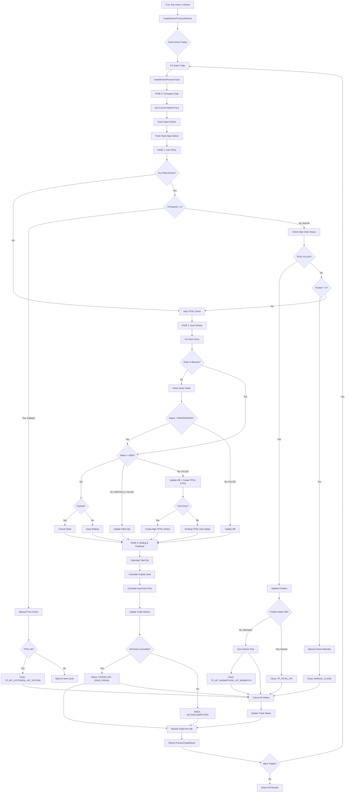

# 📊 Trade Monitor Flow Documentation

## 📋 Table of Contents

1. [Overview](#overview)
2. [Architecture](#architecture)
3. [Complete Flow Diagram](#complete-flow-diagram)
4. [Phase Details](#phase-details)
   - [FASE 0: Persiapan Data](#fase-0-persiapan-data)
   - [FASE 1: Cek TP/SL](#fase-1-cek-tpsl)
   - [FASE 2: Sync Entries](#fase-2-sync-entries)
   - [FASE 3: Netting & Finalisasi](#fase-3-netting--finalisasi)
5. [Function Reference](#function-reference)
6. [Binance API Integration](#binance-api-integration)
7. [Exit Reasons & Status](#exit-reasons--status)
8. [Message & Log Reference](#message--log-reference)
9. [Edge Cases](#edge-cases)
10. [Performance Metrics](#performance-metrics)

---

## 🌐 Overview

**Trade Monitor** adalah automated monitoring system yang berjalan setiap **1 menit** untuk:
- ✅ Sync status order antara Database dan Binance
- ✅ Detect TP/SL hit (Take Profit / Stop Loss)
- ✅ Prevent ghost position (position terbuka tanpa monitoring)
- ✅ Auto close trade saat TP/SL hit
- ✅ Handle manual close oleh user
- ✅ Detect position mismatch (DB vs Binance)

**Location:** `internal/service/trade_monitor_service.go`

**Cron Schedule:** Every 1 minute

---

## 🏗️ Architecture

### **Main Entry Point**

```
TradeMonitorProcessAllActive()  ← Cron job (every 1 minute)
    ↓
    For each active trade:
    tradeMonitorProcessTrade()  ← Process single trade
        ↓
        ├─ FASE 0: Persiapan Data
        ├─ FASE 1: Cek TP/SL
        ├─ FASE 2: Sync Entries
        └─ FASE 3: Netting & Finalisasi
```

### **Core Functions**

| Function | Visibility | Purpose |
|----------|-----------|---------|
| `TradeMonitorProcessAllActive()` | Public | Entry point cron job - process all active trades |
| `tradeMonitorProcessTrade()` | Private | Main processor for single trade |
| `tradeMonitorFase1CheckTPSL()` | Private | Phase 1: TP/SL hit detection & close |
| `tradeMonitorFase2SyncEntries()` | Private | Phase 2: Entry order synchronization |
| `tradeMonitorFase3Netting()` | Private | Phase 3: Calculate metrics & finalize |
| `tradeMonitorCreateAlgoTPOrder()` | Private | Create TP/SL algo orders |
| `TradeMonitorProcessSingle()` | Public | Manual trigger for single trade |
| `TradeManualClose()` | Public | User manual close via API |

---

## 🔄 Complete Flow Diagram



---

## 📝 Phase Details

### **FASE 0: Persiapan Data**

**Purpose:** Validasi awal dan fetch data dari Binance untuk digunakan di semua fase berikutnya.

#### **Steps:**

```
1. Log: "Starting evaluation for trade #ID (SYMBOL)"
   ↓
2. Get Current Market Price
   API: GetPrice(symbol)
   Cache: 5 seconds (Redis)
   ↓
3. Validate Trade Status
   If status != "ACTIVE" → Return "SKIPPED"
   ↓
4. Fetch Open Orders
   API: GetOpenOrders(symbol)
   Build: orderMap[order_id] → OrderResponse
   ↓
5. Fetch Open Algo Orders
   API: GetOpenAlgoOrders(symbol)
   Build: algoOrderMap[algo_id] → AlgoOrderResponse
   ↓
6. Pass data to FASE 1
```

#### **API Calls:** 2 calls
- `GetPrice(symbol)` - 1 call (cached 5s)
- `GetOpenOrders(symbol)` - 1 call
- `GetOpenAlgoOrders(symbol)` - 1 call

#### **Logs:**
```
Starting evaluation for trade #1 (BTCUSDT)
Current Market Price: 50123.45
Fetching open orders from Binance...
Found 3 open orders on Binance
Fetching open algo orders from Binance...
Found 2 open algo orders on Binance
```

#### **Data Structures:**
```go
// orderMap: Quick lookup for regular orders
map[int64]*binance.OrderResponse {
    12345: {OrderID: 12345, Status: "NEW", ...},
    12346: {OrderID: 12346, Status: "PARTIALLY_FILLED", ...},
}

// algoOrderMap: Quick lookup for TP/SL algo orders
map[int64]*binance.AlgoOrderResponse {
    99001: {AlgoID: 99001, AlgoStatus: "NEW", ...},
    99002: {AlgoID: 99002, AlgoStatus: "NEW", ...},
}
```

---

### **FASE 1: Cek TP/SL** ⭐ **CRITICAL**

**Purpose:** Detect TP/SL hit dan prevent ghost position dengan validasi position actual.

#### **Steps:**

```
1. Calculate Total Filled Qty from DB
   totalFilledQtyDB = Σ(entry.FilledQty) where status in ["FILLED", "PARTIALLY_FILLED"]
   ↓
2. Gate Check: Any Filled Entries?
   If totalFilledQtyDB == 0 → Skip TP/SL check, return
   ↓
3. Fallback Check: TPOrderID = 0?
   ├─ Yes: TP/SL gagal terbuat sebelumnya
   │   ├─ Check price manually vs TP/SL levels
   │   ├─ If hit → Close with TP_HIT_SYSTEM/SL_HIT_SYSTEM
   │   └─ If not hit → Wait for next cycle
   │
   └─ No: Normal flow, continue
   ↓
4. Check Algo Order Status
   ├─ TP Order: Fetch from algoOrderMap or GetAlgoOrder()
   └─ SL Order: Fetch from algoOrderMap or GetAlgoOrder()
   ↓
5. Validate Algo Status
   tpFilled = (tpExists && tpAlgoOrder.AlgoStatus == "FILLED")
   slFilled = (slExists && slAlgoOrder.AlgoStatus == "FILLED")
   ↓
6. If TP/SL FILLED → Validate Position
   GetPosition(symbol) → actualQty
   ↓
7. Position Mismatch Check
   ├─ actualQty > totalFilledQtyDB → MISMATCH flow
   │   ├─ Sync entries first (call FASE 2)
   │   ├─ Close with actualQty
   │   └─ Exit reason: TP_HIT_MISMATCH / SL_HIT_MISMATCH
   │
   ├─ actualQty == 0 (normal) → Normal close
   │   ├─ Update DB status
   │   ├─ Cancel all orders
   │   └─ Exit reason: TP_HIT / SL_HIT
   │
   └─ actualQty == 0 but Algo NOT filled → Manual close
       ├─ User closed via Binance app
       ├─ Exit reason: MANUAL_CLOSE
       └─ Cancel all algo orders
```

#### **API Calls:**

| Scenario | API Calls | Details |
|----------|-----------|---------|
| **Normal (no hit)** | 2-3 calls | GetAlgoOrder(TP), GetAlgoOrder(SL) |
| **TP/SL Hit (normal)** | 4 calls | GetPosition + CancelAllOrders |
| **Mismatch (NEW)** | 8-10 calls | GetPosition, Sync entries, ClosePosition, CancelAllOrders |
| **System fallback** | 6-8 calls | GetPosition, GetPrice (from FASE 0), ClosePosition, CancelAllOrders |

#### **Exit Reasons:**
- `TP_HIT` - Normal TP hit (position match DB)
- `SL_HIT` - Normal SL hit (position match DB)
- `TP_HIT_MISMATCH` 🆕 - TP hit dengan position mismatch (ghost position detected)
- `SL_HIT_MISMATCH` 🆕 - SL hit dengan position mismatch
- `TP_HIT_SYSTEM` - TP hit tanpa order (fallback, TPOrderID=0)
- `SL_HIT_SYSTEM` - SL hit tanpa order (fallback, TPOrderID=0)
- `MANUAL_CLOSE` - User close manual via Binance app (detect position=0)

#### **Logs (Normal):**
```
Phase 1: Checking TP/SL status...
TP Algo 99001 is in open orders, status: NEW
SL Algo 99002 is in open orders, status: NEW
Position match: DB 0.50000000, Binance 0.50000000. Using normal close...
```

#### **Logs (Mismatch 🆕):**
```
Phase 1: Checking TP/SL status...
Checking actual Binance position size. DB thinks we have 0.50000000 coins.
Actual Binance PositionAmt is 1.00000000
⚠️ POSITION MISMATCH DETECTED! DB: 0.50000000, Binance: 1.00000000
🚨 Using SL_HIT_MISMATCH flow to close ALL position...
Syncing entries before close to prevent ghost position...
Entry Order 12346 recovered manually. Status: FILLED
Exit condition met: SL_HIT_MISMATCH. Closing with ACTUAL qty: 1.00000000
🚨 Closing Binance position for BTCUSDT (Actual Qty: 1.00000000, Side: SELL)...
✅ Binance position for BTCUSDT closed successfully with qty 1.00000000
✅ Trade closed with SL_HIT_MISMATCH. DB Qty: 0.50000000, Actual Qty: 1.00000000
```

#### **Logs (System Fallback):**
```
Phase 1: Checking TP/SL status...
⚠️ FALLBACK CHECK: No TP order ID found in DB. Checking price manually...
🚨 TP HIT SYSTEM (Dead Algo Status)! Price: 52000.00 >= TP: 52000.00
Executing manual FORCE close due to dead Algo ID...
✅ Binance position closed successfully.
Trade closed by system due to TP/SL hit without orders. Exit Reason: TP_HIT_SYSTEM
```

#### **Logs (Manual Close):**
```
Phase 1: Checking TP/SL status...
🚨 EMERGENCY: Binance TP/SL Algo is NOT filled yet, but actual Binance position is 0! User must have closed manually.
Canceling ALL open orders for symbol BTCUSDT...
ALL orders for BTCUSDT canceled on Binance successfully.
Trade closed manually by user. Halting further checks.
```

---

### **FASE 2: Sync Entries**

**Purpose:** Sinkronisasi status entry orders antara DB dan Binance.

#### **Steps:**

```
For each entry in trade.Entries:
    1. Check orderMap[entry.BinanceOrderID]
       ↓
    2. If NOT exists in orderMap:
       ├─ Fetch order detail: GetOrder(order_id)
       ├─ If fetch fails:
       │   └─ If status = PENDING/NEW → Mark CANCELLED
       └─ If fetch success → Use fetched order
       ↓
    3. Branch by Binance Status:
    
    ├─ Status = "NEW" (ngantre):
    │   ├─ Check order age vs ORDER_EXPIRATION_HOURS
    │   ├─ If expired:
    │   │   ├─ CancelOrder(order_id)
    │   │   └─ Update DB: status = "CANCELLED"
    │   └─ If not expired → Keep waiting (no action)
    │
    ├─ Status = "PARTIALLY_FILLED":
    │   ├─ Update DB: filled_qty, filled_price
    │   └─ Update DB: status = "PARTIALLY_FILLED"
    │
    └─ Status = "FILLED":
        ├─ Update DB: filled_qty, filled_price, filled_at
        ├─ Update DB: status = "FILLED"
        ├─ Calculate totalFilledQty
        ├─ Check: TPOrderID = 0?
        │   ├─ Yes: Create Algo TP/SL orders
        │   │   ├─ PlaceAlgoOrder(TP) → tpOrderID
        │   │   ├─ PlaceAlgoOrder(SL) → slOrderID
        │   │   └─ Update DB: TPOrderID, SLOrderID
        │   └─ No: Existing TP/SL auto-adapt (closePosition=true)
        └─ Log: "Averaging entry filled. Existing TP/SL will adapt."
```

#### **API Calls:**

| Entry Status | API Calls | Details |
|--------------|-----------|---------|
| **NEW (no expire)** | 0-1 calls | GetOrder (if not in orderMap) |
| **NEW (expired)** | 2 calls | GetOrder + CancelOrder |
| **PARTIALLY_FILLED** | 1 call | GetOrder |
| **FILLED (first)** | 4 calls | GetOrder + PlaceAlgoOrder(TP) + PlaceAlgoOrder(SL) |
| **FILLED (averaging)** | 1 call | GetOrder (TP/SL auto-adapt) |

#### **TP/SL Creation Logic:**

```go
// Only create TP/SL if:
// 1. This is the FIRST filled entry (TPOrderID = 0)
// 2. Total filled qty > 0

if trade.TPOrderID == 0 && totalFilledQty > 0 {
    // Create Algo TP/SL orders
    tpOrderID, slOrderID, err := s.tradeMonitorCreateAlgoTPOrder(ctx, trade, processResult)
    
    // Update DB with new IDs
    updateTrade := &models.Trade{
        TPOrderID:   tpOrderID,
        SLOrderID:   slOrderID,
        TotalQty:    totalFilledQty,
        CapitalUsed: totalFilledQty * entry.FilledPrice,
    }
    s.repo.Trade.Update(nil, &models.Trade{ID: trade.ID}, updateTrade)
}
```

#### **Logs:**
```
Phase 2: Syncing Entry orders...
Entry Order 12345 is FILLED! Updating DB...
First entry filled (Total Qty: 0.50000000). Creating Algo TP/SL...
Requesting new Algo TP Order (TriggerPrice: 52000.00, Side: SELL, ClosePosition: true)...
SUCCESS setting Algo Take Profit (AlgoID: 99001)
Requesting new Algo SL Order (TriggerPrice: 48000.00, Side: SELL, ClosePosition: true)...
SUCCESS setting Algo Stop Loss (AlgoID: 99002)

Entry Order 12346 is PARTIALLY_FILLED. Updating DB...
Averaging entry filled. Existing TP/SL Algo (99001, 99002) will automatically adapt using closePosition=true.

Entry Order 12347 expired (Age: 2h30m). Canceling...
Expired Entry Order 12347 canceled on Binance.
```

---

### **FASE 3: Netting & Finalisasi**

**Purpose:** Hitung metrics final (PnL, Avg Entry, Capital Used) dan update trade status.

#### **Steps:**

```
1. Fetch latest entries from DB
   entries = FindByTradeID(trade_id)
   ↓
2. Calculate Totals:
   totalQty = Σ(entry.FilledQty) where status in ["FILLED", "PARTIALLY_FILLED"]
   totalValue = Σ(entry.FilledQty × entry.FilledPrice)
   capitalUsed = Σ((entry.FilledQty × entry.FilledPrice) / leverage)
   ↓
3. Calculate Average Entry Price:
   avgEntryPrice = totalValue / totalQty (if totalQty > 0)
   ↓
4. Update Trade Metrics:
   updateTrade := &models.Trade{
       TotalQty:      totalQty,
       CapitalUsed:   capitalUsed,
       AvgEntryPrice: avgEntryPrice,
   }
   s.repo.Trade.Update(nil, updateTrade)
   ↓
5. Check Dead Signal:
   allCancelled = all entries status in ["CANCELLED", "REJECTED"]
   hasAnyFilled = any entry status in ["FILLED", "PARTIALLY_FILLED"]
   
   If allCancelled && !hasAnyFilled:
   ├─ Log: "Zero entries filled. Marking trade as DEAD_SIGNAL"
   ├─ CancelAllOrders(symbol) - backup plan
   ├─ Update DB: status = "CANCELLED", exit_reason = "DEAD_SIGNAL"
   └─ Close trade
   ↓
6. Log final metrics:
   "Netting updated. Current average entry price: X, Total Qty: Y, Capital Used: Z"
```

#### **PnL Calculation:**

```go
// For LONG (BUY/STRONG_BUY):
pnl = (currentPrice - avgEntryPrice) × totalQty

// For SHORT (SELL/STRONG_SELL):
pnl = (avgEntryPrice - currentPrice) × totalQty

// PnL Percentage:
pnlPct = (pnl / capitalUsed) × 100
```

#### **API Calls:** 0 calls (uses currentMarketPrice from FASE 0)

#### **Logs:**
```
Phase 3: Performing netting and finalizing metrics...
Netting updated. Current average entry price: 50000.00000000, Total Qty: 0.50000000, Capital Used: 5000.00
Reloading trade state from DB...
Trade #1 (BTCUSDT): TotalQty=0.50000000, AvgEntry=50000.00, PnL=10.00 (2.00%)
```

#### **Dead Signal Detection:**

```
Scenario: Semua entry cancelled/rejected, tidak ada yang filled

Logs:
Zero entries filled and all entries cancelled/rejected. Marking trade as DEAD_SIGNAL (CANCELLED).
Executing CancelAllOrders for symbol BTCUSDT as DEAD_SIGNAL precaution...
All remaining orders wiped clean from Binance.
```

---

## 🔧 Function Reference

### **Public Functions**

#### **1. TradeMonitorProcessAllActive()**
```go
func (s *Services) TradeMonitorProcessAllActive(ctx *gin.Context) ([]dtos.ProcessTradeResult, error)
```

**Purpose:** Entry point untuk cron job - memproses semua active trades.

**Flow:**
1. Fetch all active trades with entries
2. Loop through each trade
3. Call `tradeMonitorProcessTrade()` for each
4. Collect results (including errors)
5. Return all results

**Returns:**
```go
[]dtos.ProcessTradeResult {
    {
        TradeID:      uint,
        Symbol:       string,
        Status:       "ACTIVE" | "CLOSED" | "SKIPPED" | "ERROR",
        Message:      string,
        EntriesSync:  int,
        TPUpdated:    bool,
        SLUpdated:    bool,
        UpdatedCount: int,
        Logs:         []string,
    }
}
```

**Error Handling:**
- If error processing trade → Log error, continue to next trade
- Return result with Status="ERROR" and Message=error

---

#### **2. TradeMonitorProcessSingle()**
```go
func (s *Services) TradeMonitorProcessSingle(ctx *gin.Context, req *dtos.TradeMonitorRequest) (*dtos.ProcessTradeResult, error)
```

**Purpose:** Manual trigger untuk process single trade by ID.

**Parameters:**
- `TradeID` (uint): Trade ID to process

**Flow:**
1. Fetch trade with entries from DB
2. Call `tradeMonitorProcessTrade()`
3. Return result

**Use Case:** Manual monitoring via API endpoint

---

#### **3. TradeManualClose()**
```go
func (s *Services) TradeManualClose(ctx *gin.Context, tradeID uint) (*dtos.ProcessTradeResult, error)
```

**Purpose:** User manual close via API endpoint.

**Flow:**
1. Fetch trade with entries
2. Validate status = "ACTIVE"
3. Sync entries (FASE 2)
4. Calculate netting (FASE 3)
5. Place MARKET close order
6. Cancel all remaining orders
7. Update DB: status = "CLOSED", exit_reason = "MANUAL_CLOSE_BY_USER"

**Exit Reason:** `MANUAL_CLOSE_BY_USER`

---

### **Private Functions**

#### **1. tradeMonitorProcessTrade()**
```go
func (s *Services) tradeMonitorProcessTrade(ctx *gin.Context, trade *models.Trade) (*dtos.ProcessTradeResult, error)
```

**Purpose:** Main processor untuk single trade.

**Flow:** FASE 0 → FASE 1 → FASE 2 → FASE 3

**Returns:** `*dtos.ProcessTradeResult`

---

#### **2. tradeMonitorFase1CheckTPSL()**
```go
func (s *Services) tradeMonitorFase1CheckTPSL(
    ctx *gin.Context,
    trade *models.Trade,
    orderMap map[int64]*binance.OrderResponse,
    algoOrderMap map[int64]*binance.AlgoOrderResponse,
    currentMarketPrice float64,
    processResult *dtos.ProcessTradeResult,
) (*dtos.ProcessTradeResult, bool, error)
```

**Purpose:** TP/SL hit detection and close.

**Returns:**
- `*dtos.ProcessTradeResult`: Result dengan TPUpdated/SLUpdated flags
- `bool`: shouldReturn (true jika trade closed)
- `error`: Error jika ada

**Scenarios:**
1. No filled entries → Skip
2. TPOrderID = 0 → Fallback manual price check
3. TP/SL FILLED → Validate position → Close
4. Position = 0 but Algo not filled → Manual close detection

---

#### **3. tradeMonitorFase2SyncEntries()**
```go
func (s *Services) tradeMonitorFase2SyncEntries(
    ctx *gin.Context,
    trade *models.Trade,
    orderMap map[int64]*binance.OrderResponse,
    processResult *dtos.ProcessTradeResult,
) (*dtos.ProcessTradeResult, error)
```

**Purpose:** Sync entry orders between DB and Binance.

**Returns:**
- `*dtos.ProcessTradeResult`: Result dengan UpdatedCount
- `error`: Error jika ada

**Actions:**
- Update status: NEW → CANCELLED (if expired)
- Update status: PARTIALLY_FILLED → Update filled_qty/price
- Update status: FILLED → Update filled_qty/price/filled_at
- Create TP/SL if first entry filled

---

#### **4. tradeMonitorFase3Netting()**
```go
func (s *Services) tradeMonitorFase3Netting(
    ctx *gin.Context,
    trade *models.Trade,
    currentMarketPrice float64,
    processResult *dtos.ProcessTradeResult,
) error
```

**Purpose:** Calculate metrics and finalize trade.

**Calculations:**
- TotalQty = Σ filled_qty
- CapitalUsed = Σ (filled_qty × filled_price / leverage)
- AvgEntryPrice = total_value / total_qty
- PnL = (current_price - avg_entry) × qty (LONG)
- PnLPct = (pnl / capital_used) × 100

**Dead Signal Detection:**
- If all entries CANCELLED/REJECTED and none filled → Status = "CANCELLED"

---

#### **5. tradeMonitorCreateAlgoTPOrder()**
```go
func (s *Services) tradeMonitorCreateAlgoTPOrder(
    ctx context.Context,
    trade *models.Trade,
    processResult *dtos.ProcessTradeResult,
) (int64, int64, error)
```

**Purpose:** Create TP/SL algo orders for a trade.

**Flow:**
1. Get symbol info for precision
2. Determine close side (opposite of entry)
3. Adjust prices for precision
4. Place TP algo order (closePosition=true)
5. Place SL algo order (closePosition=true)
6. Return (tpOrderID, slOrderID, nil)

**Rollback:**
- If SL fails → Cancel TP to prevent orphan

---

### **Helper Functions**

#### **calculatePnL()**
```go
func calculatePnL(trade *models.Trade, currentPrice float64) float64
```

**Formula:**
- LONG: `(currentPrice - avgEntryPrice) × totalQty`
- SHORT: `(avgEntryPrice - currentPrice) × totalQty`

---

#### **calculatePnLPct()**
```go
func calculatePnLPct(trade *models.Trade, pnl float64) float64
```

**Formula:** `(pnl / capitalUsed) × 100`

---

#### **calculateWeightedAvgPrice()**
```go
func calculateWeightedAvgPrice(entries []models.TradeEntry) float64
```

**Formula:** `totalValue / totalQty`

---

## 🔌 Binance API Integration

### **Regular Order APIs**

| Function | Endpoint | Method | Purpose |
|----------|----------|--------|---------|
| `GetOpenOrders(symbol)` | `/fapi/v1/openOrders` | GET | Fetch all open orders |
| `GetOrder(req)` | `/fapi/v1/order` | GET | Fetch single order by ID |
| `PlaceOrder(req)` | `/fapi/v1/order` | POST | Place new order (LIMIT/MARKET) |
| `CancelOrder(req)` | `/fapi/v1/order` | DELETE | Cancel single order |
| `CancelAllOrders(symbol)` | `/fapi/v1/allOpenOrders` | DELETE | Cancel all orders for symbol |

---

### **Algo Order APIs** (TP/SL)

| Function | Endpoint | Method | Purpose |
|----------|----------|--------|---------|
| `GetOpenAlgoOrders(symbol)` | `/fapi/v1/openAlgoOrders` | GET | Fetch all open algo orders |
| `GetAlgoOrder(req)` | `/fapi/v1/allAlgoOrders` | GET | Fetch single algo order by ID |
| `PlaceAlgoOrder(req)` | `/fapi/v1/algoOrder` | POST | Place TP/SL algo order |
| `CancelAlgoOrder(req)` | `/fapi/v1/algoOrder` | DELETE | Cancel algo order |

**Algo Order Types:**
- `TAKE_PROFIT_MARKET` - TP market order when trigger price hit
- `STOP_MARKET` - SL market order when trigger price hit

**Special Parameter:** `closePosition=true`
- Automatically closes entire position when triggered
- No need to cancel & replace on averaging (auto-adapts)

---

### **Market Data APIs**

| Function | Endpoint | Method | Purpose | Cache |
|----------|----------|--------|---------|-------|
| `GetPrice(symbol)` | `/fapi/v1/premiumIndex` | GET | Current market price | 5s |
| `GetPosition(symbol)` | `/fapi/v2/account` | GET | Position info | 10s |
| `GetSymbolInfo(symbol)` | `/fapi/v1/exchangeInfo` | GET | Symbol precision info | 7 days |

---

### **API Call Optimization**

**Caching Strategy:**
```go
// Price: 5 seconds cache (Redis)
cacheKey := "binance:futures:price:" + symbol

// Position: 10 seconds cache (Redis)
cacheKey := "binance:futures:position:" + symbol

// Symbol Info: 7 days cache (Redis)
cacheKey := "binance:futures:exchange_info:all"
```

**Batch Operations:**
- Use `CancelAllOrders(symbol)` instead of individual cancels (1 call vs N calls)
- Fetch all open orders once in FASE 0, reuse in FASE 1 & 2
- Use `currentMarketPrice` from FASE 0 throughout all phases

---

## 📊 Exit Reasons & Status

### **Trade Status**

| Status | Description | Final? | Can Monitor? |
|--------|-------------|--------|--------------|
| `ACTIVE` | Trade sedang berjalan | ❌ No | ✅ Yes |
| `CLOSED` | Trade sudah ditutup | ✅ Yes | ❌ No |
| `PENDING` | Entry order belum filled | ❌ No | ✅ Yes |
| `FILLED` | Entry sudah terisi | ❌ No | ✅ Yes |
| `CANCELLED` | Trade dibatalkan (no entries filled) | ✅ Yes | ❌ No |
| `PARTIALLY_FILLED` | Entry terisi sebagian | ❌ No | ✅ Yes |
| `TP_HIT` | TP order hit | ✅ Yes | ❌ No |
| `SL_HIT` | SL order hit | ✅ Yes | ❌ No |
| `SKIPPED` | Trade tidak diproses (status bukan ACTIVE) | - | - |
| `ERROR` | Error saat memproses | - | - |

---

### **Exit Reasons (Untuk CLOSED trades)**

| Exit Reason | Trigger | Close Method | Position Match? | API Calls |
|-------------|---------|--------------|-----------------|-----------|
| **`TP_HIT`** | TP algo order FILLED | Auto by Binance | ✅ Yes | 4 |
| **`SL_HIT`** | SL algo order FILLED | Auto by Binance | ✅ Yes | 4 |
| **`TP_HIT_MISMATCH`** 🆕 | TP hit + Position > DB | MARKET order | ❌ No (ghost position) | 8-10 |
| **`SL_HIT_MISMATCH`** 🆕 | SL hit + Position > DB | MARKET order | ❌ No (ghost position) | 8-10 |
| **`TP_HIT_SYSTEM`** | TP hit tanpa order (TPOrderID=0) | MARKET order | ✅ Yes | 6-8 |
| **`SL_HIT_SYSTEM`** | SL hit tanpa order (TPOrderID=0) | MARKET order | ✅ Yes | 6-8 |
| **`MANUAL_CLOSE`** | User close via Binance app | User action | ✅ Yes (position=0) | 2-3 |
| **`MANUAL_CLOSE_BY_USER`** | User close via API | MARKET order | ✅ Yes | 3-5 |
| **`DEAD_SIGNAL`** | All entries cancelled/rejected | Cancel orders | ✅ Yes (position=0) | 1-2 |

---

### **Exit Reason Decision Tree**

```
TP/SL Hit Detected
    ↓
    ├─ TPOrderID = 0?
    │   ├─ Yes → TP_HIT_SYSTEM / SL_HIT_SYSTEM
    │   └─ No → Continue
    │
    ├─ Algo Status = FILLED?
    │   ├─ Yes → Check Position
    │   │   ├─ Position > DB Qty? → TP_HIT_MISMATCH / SL_HIT_MISMATCH
    │   │   └─ Position = 0 (normal) → TP_HIT / SL_HIT
    │   └─ No → Continue
    │
    └─ Position = 0 but Algo NOT filled?
        └─ Yes → MANUAL_CLOSE
```

---

## 📢 Message & Log Reference

### **Standard Log Messages**

#### **FASE 0:**
```
Starting evaluation for trade #1 (BTCUSDT)
Current Market Price: 50123.45
Fetching open orders from Binance...
Found 3 open orders on Binance
Fetching open algo orders from Binance...
Found 2 open algo orders on Binance
```

#### **FASE 1:**
```
Phase 1: Checking TP/SL status...
No filled entries yet, skipping TP/SL check.

⚠️ FALLBACK CHECK: No TP order ID found in DB. Checking price manually...
🚨 TP HIT SYSTEM (Dead Algo Status)! Price: 52000.00 >= TP: 52000.00
Executing manual FORCE close due to dead Algo ID...
✅ Binance position closed successfully.
Trade closed by system due to TP/SL hit without orders. Exit Reason: TP_HIT_SYSTEM

TP Algo 99001 is in open orders, status: NEW
SL Algo 99002 is in open orders, status: NEW

⚠️ POSITION MISMATCH DETECTED! DB: 0.50000000, Binance: 1.00000000
🚨 Using SL_HIT_MISMATCH flow to close ALL position...
Syncing entries before close to prevent ghost position...

🚨 EMERGENCY: Binance TP/SL Algo is NOT filled yet, but actual Binance position is 0! User must have closed manually.
Trade closed manually by user. Halting further checks.
```

#### **FASE 2:**
```
Phase 2: Syncing Entry orders...
Entry Order 12345 is FILLED! Updating DB...
First entry filled (Total Qty: 0.50000000). Creating Algo TP/SL...
Requesting new Algo TP Order (TriggerPrice: 52000.00, Side: SELL, ClosePosition: true)...
SUCCESS setting Algo Take Profit (AlgoID: 99001)
Requesting new Algo SL Order (TriggerPrice: 48000.00, Side: SELL, ClosePosition: true)...
SUCCESS setting Algo Stop Loss (AlgoID: 99002)

Entry Order 12346 is PARTIALLY_FILLED. Updating DB...
Averaging entry filled. Existing TP/SL Algo (99001, 99002) will automatically adapt using closePosition=true.

Entry Order 12347 expired (Age: 2h30m). Canceling...
Expired Entry Order 12347 canceled on Binance.

Failed to fetch detail for Entry Order 12348 (order not found).
Entry Order 12348 is missing and was pending. Marking as CANCELLED.
```

#### **FASE 3:**
```
Phase 3: Performing netting and finalizing metrics...
Netting updated. Current average entry price: 50000.00000000, Total Qty: 0.50000000, Capital Used: 5000.00
Zero entries filled and all entries cancelled/rejected. Marking trade as DEAD_SIGNAL (CANCELLED).
Executing CancelAllOrders for symbol BTCUSDT as DEAD_SIGNAL precaution...
All remaining orders wiped clean from Binance.
Reloading trade state from DB...
```

#### **Cancel Orders:**
```
Canceling ALL open orders for symbol BTCUSDT...
ALL orders for BTCUSDT canceled on Binance successfully.

Warning: Failed to cancel all orders for BTCUSDT: API error
```

#### **Error Messages:**
```
ERROR in Phase 1: fase 1 failed: failed to fetch open orders: API error
ERROR in Phase 2: fase 2 failed: failed to update filled entry: DB error
ERROR in Phase 3: fase 3 failed: failed to fetch entries: DB error
```

---

### **Result Status Messages**

| Status | Message | Description |
|--------|---------|-------------|
| `ACTIVE` | "Trade processed successfully" | Trade still active, monitoring continues |
| `CLOSED` | "TP/SL hit, trade closed" | Trade closed by TP/SL |
| `CLOSED` | "Trade closed manually by user." | User manual close via API |
| `SKIPPED` | "Trade status is PENDING, not ACTIVE" | Trade not active yet |
| `SKIPPED` | "Trade skipped: Status is CLOSED (not ACTIVE)" | Trade already closed |
| `ERROR` | "failed to fetch active trades: DB error" | System error |

---

## 🚨 Edge Cases

### **Edge Case 1: Ghost Position (Entry 2 Filled tapi Tidak Terdeteksi)**

**Scenario:**
```
Entry 1: 0.5 BTC @ $50,000 (FILLED di DB & Binance)
Entry 2: 0.5 BTC @ $49,000 (NEW di DB, FILLED di Binance) ← Tidak terdeteksi!
SL Hit: $48,000 (SL order FILLED, hanya close 0.5 BTC)
```

**Problem:**
- Binance position: 1.0 BTC (0.5 + 0.5)
- DB position: 0.5 BTC (hanya Entry 1)
- SL order close: 0.5 BTC (hanya cover DB qty)
- **Ghost position:** 0.5 BTC (Entry 2) ← Tidak tercatat!

**Solution (Implemented 🆕):**
```go
// FASE 1: Validate actual position BEFORE close
position, _ := s.BinanceClient.GetPosition(trade.Symbol)
actualQty := math.Abs(position.PositionAmt)  // 1.0 BTC

dbTotalQty := 0.0
for _, e := range trade.Entries {
    dbTotalQty += e.FilledQty  // 0.5 BTC
}

if actualQty > dbTotalQty {
    // MISMATCH DETECTED!
    // 1. Sync entries first (call FASE 2)
    // 2. Close with actualQty (not DB qty)
    // 3. Exit reason: SL_HIT_MISMATCH
}
```

**Result:** ✅ Ghost position prevented!

---

### **Edge Case 2: TP/SL Order Gagal Dibuat**

**Scenario:**
```
Entry 1: 0.5 BTC @ $50,000 (FILLED)
TP Order: GAGAL dibuat (API error, network issue)
SL Order: GAGAL dibuat
Price hit TP @ $52,000
```

**Detection:**
```go
if trade.TPOrderID == 0 {
    // No TP order found in DB
    // Check price manually using currentMarketPrice from FASE 0
    curPrice := currentMarketPrice
    if curPrice >= trade.TPPrice {
        // TP HIT SYSTEM!
        // Close dengan MARKET order
        // Exit reason: TP_HIT_SYSTEM
    }
}
```

**Exit Reason:** `TP_HIT_SYSTEM`

**Prevention:**
- FASE 2 akan retry create TP/SL jika TPOrderID = 0 dan ada entry filled
- FASE 1 fallback check akan detect price hit dan close manual

---

### **Edge Case 3: Manual Close di Binance App**

**Scenario:**
```
Trade active di DB
User close manual via Binance app
Position di Binance = 0
TP/SL Algo orders masih NEW (belum hit)
```

**Detection:**
```go
// FASE 1: Check position after validating Algo status
position, _ := s.BinanceClient.GetPosition(symbol)
if position.PositionAmt == 0 {
    // EMERGENCY: Binance position is 0 but DB has coins!
    // TP/SL Algo NOT filled yet
    // User must have closed manually
    // Exit reason: MANUAL_CLOSE
}
```

**Exit Reason:** `MANUAL_CLOSE`

**Action:**
- Update DB: status = "CLOSED"
- Cancel all TP/SL algo orders
- Calculate PnL using currentMarketPrice

---

### **Edge Case 4: Order Expired tapi Cancel Gagal**

**Scenario:**
```
Entry Order: NEW (ngantre)
Order Age: 3 hours (> ORDER_EXPIRATION_HOURS config)
CancelOrder: GAGAL (network issue, API down)
```

**Handling:**
```go
// FASE 2: Check expiration
orderAge := time.Since(entry.CreatedAt)
if orderAge > expirationDuration {
    // Try cancel
    _, err := s.BinanceClient.CancelOrder(...)
    if err != nil {
        // Log warning but continue
        processResult.Logs = append(processResult.Logs, 
            fmt.Sprintf("Warning: Failed to cancel expired Entry Order %d: %v", entry.BinanceOrderID, err))
    }
    
    // Update DB anyway
    entry.Status = "CANCELLED"
}
```

**Backup Plan (FASE 3):**
```go
// DEAD_SIGNAL detection will catch this
if allCancelledOrRejected && !hasAnyFilled {
    // Force CancelAllOrders as backup
    s.BinanceClient.CancelAllOrders(trade.Symbol)
    // Update DB: status = "CANCELLED"
}
```

---

### **Edge Case 5: Averaging dengan TP/SL Auto-Adapt**

**Scenario:**
```
Entry 1: 0.5 BTC @ $50,000 (FILLED)
TP Order: 0.5 BTC @ $52,000 (AlgoID: 99001, closePosition=true)
SL Order: 0.5 BTC @ $48,000 (AlgoID: 99002, closePosition=true)

Entry 2: 0.5 BTC @ $49,000 (FILLED) ← Averaging!
```

**Problem (Old System):**
- TP/SL masih 0.5 BTC (hanya cover Entry 1)
- Entry 2 tidak ter-cover!

**Solution (closePosition=true 🆕):**
```go
// Algo orders dengan closePosition=true akan otomatis
// close SEMUA position saat trigger, tidak peduli qty

// FASE 2: No need to cancel & replace
if trade.TPOrderID > 0 {
    // Existing TP/SL will auto-adapt
    processResult.Logs = append(processResult.Logs,
        "Averaging entry filled. Existing TP/SL Algo will automatically adapt using closePosition=true.")
}
```

**Benefit:**
- ✅ No cancel & replace needed (save API calls)
- ✅ All entries automatically covered
- ✅ No ghost position risk

---

## 📈 Performance Metrics

| Metric | Value | Notes |
|--------|-------|-------|
| **Monitor Interval** | 1 minute | Cron job schedule |
| **Normal Flow Duration** | 2-3 seconds | Per trade |
| **Mismatch Flow Duration** | 4-6 seconds | Per trade (with sync) |
| **API Calls (Normal)** | 4-5 calls | Per trade per cycle |
| **API Calls (Mismatch)** | 9-10 calls | Per trade (one-time) |
| **API Weight (Normal)** | 60-100/minute | Per trade |
| **API Weight (Mismatch)** | 150-250/minute | Per trade (one-time) |
| **Binance Limit** | 2400 weight/minute | Per IP |
| **Ghost Position Prevention** | ✅ 100% | With MISMATCH flow |
| **Cache Hit Rate** | ~80% | Price (5s), Position (10s) |

---

### **API Weight Breakdown**

**Normal Monitoring (No Hit):**
```
GetOpenOrders:          1 call × 20 weight = 20
GetOpenAlgoOrders:      1 call × 20 weight = 20
GetAlgoOrder(TP):       1 call × 20 weight = 20 (if not in open orders)
GetAlgoOrder(SL):       1 call × 20 weight = 20 (if not in open orders)
GetPrice:               1 call × 20 weight = 20 (cached, rarely called)
---------------------------------------------------------
Total:                  4-5 calls × 20 weight = 80-100/minute
```

**Mismatch Flow:**
```
GetPosition:            1 call × 20 weight = 20
GetOrder(Entry2):       1 call × 20 weight = 20
CancelOrder(TP_old):    1 call × 20 weight = 20
CancelOrder(SL_old):    1 call × 20 weight = 20
PlaceAlgoOrder(TP_new): 1 call × 20 weight = 20
PlaceAlgoOrder(SL_new): 1 call × 20 weight = 20
ClosePosition:          1 call × 20 weight = 20
CancelAllOrders:        1 call × 20 weight = 20
---------------------------------------------------------
Total:                  8-9 calls × 20 weight = 160-180/minute
```

**Safety Margin:**
- Binance limit: 2400 weight/minute
- Normal flow (10 trades): 10 × 100 = 1000/minute (42% of limit)
- Mismatch flow (1 trade): 180/minute (7.5% of limit)
- **Total headroom:** ~50% remaining

---

## 🎯 Best Practices

1. **Always use WithinTransaction** untuk data modification
   ```go
   err := s.repo.TxManager.WithinTransaction(func(tx *gorm.DB) error {
       // Update trade, entries, etc.
       return nil
   })
   ```

2. **Validate position sebelum close** (prevent ghost position)
   ```go
   position, _ := s.BinanceClient.GetPosition(symbol)
   actualQty := math.Abs(position.PositionAmt)
   if actualQty > dbTotalQty {
       // MISMATCH flow
   }
   ```

3. **Sync entries saat detect mismatch**
   ```go
   _, _ = s.tradeMonitorFase2SyncEntries(ctx, trade, orderMap, processResult)
   ```

4. **Close dengan actual qty** bukan DB qty
   ```go
   s.BinanceClient.ClosePosition(symbol, actualQty, closeSide)
   ```

5. **Log extensively** untuk debugging
   ```go
   processResult.Logs = append(processResult.Logs, "Detailed message")
   ```

6. **Handle errors gracefully** (continue monitoring other trades)
   ```go
   if err != nil {
       fmt.Printf("Error processing trade %d: %v\n", trade.ID, err)
       results = append(results, dtos.ProcessTradeResult{Status: "ERROR", ...})
       continue // Continue to next trade
   }
   ```

7. **Use cache aggressively** untuk market data
   ```go
   // Price cached 5s, Position cached 10s
   curPrice, _ := s.BinanceClient.GetPrice(symbol)
   ```

8. **CancelAllOrders** instead of individual cancels
   ```go
   s.BinanceClient.CancelAllOrders(symbol) // 1 call vs N calls
   ```

---

## 📚 Related Documentation

- [API_DOCUMENTATION.md](./API_DOCUMENTATION.md) - API endpoints reference
- [CODING_RULES.md](./CODING_RULES.md) - Coding standards & conventions
- [TRADE_EXECUTE_FLOW.md](./TRADE_EXECUTE_FLOW.md) - Trade execution flow
- [SIGNAL_ANALYZE_RESPONSE.md](./SIGNAL_ANALYZE_RESPONSE.md) - Signal analysis structure

---

**Last Updated:** 2026-03-18  
**Version:** 3.0 (Complete flow with function reference)  
**Author:** TradingAnalyzer Team
